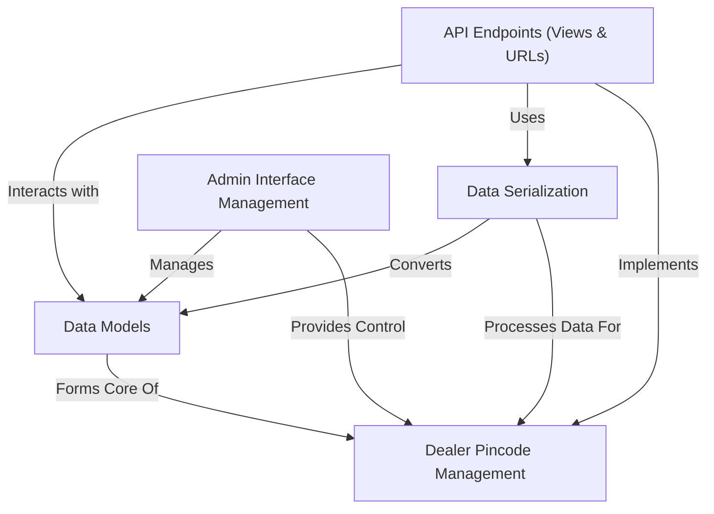
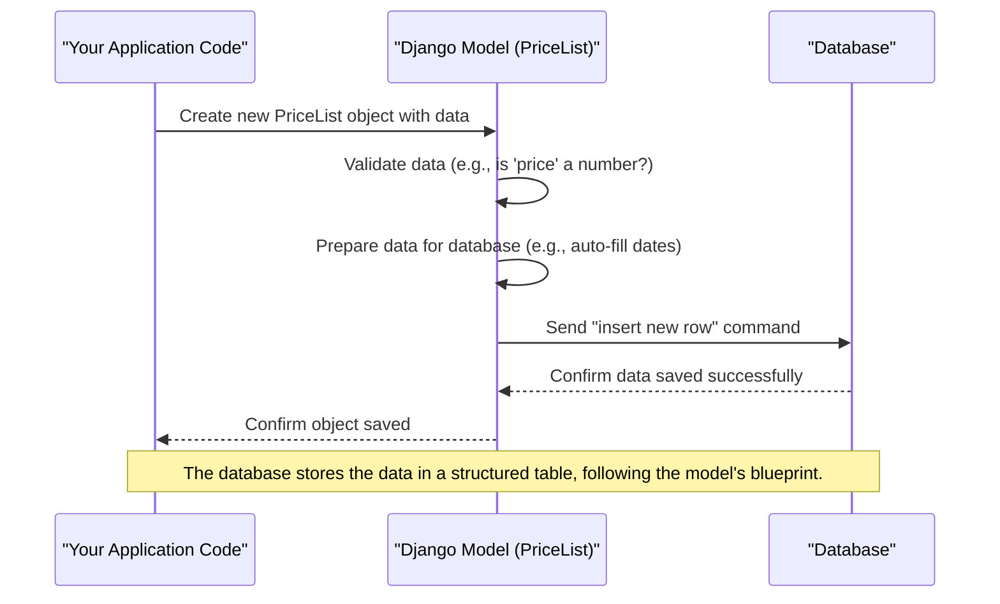
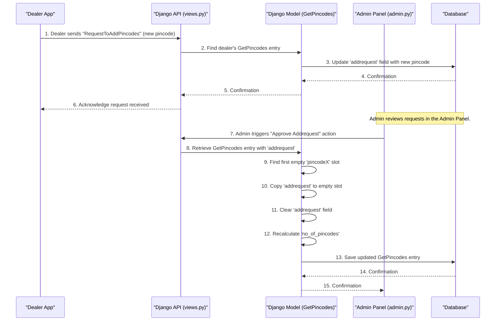
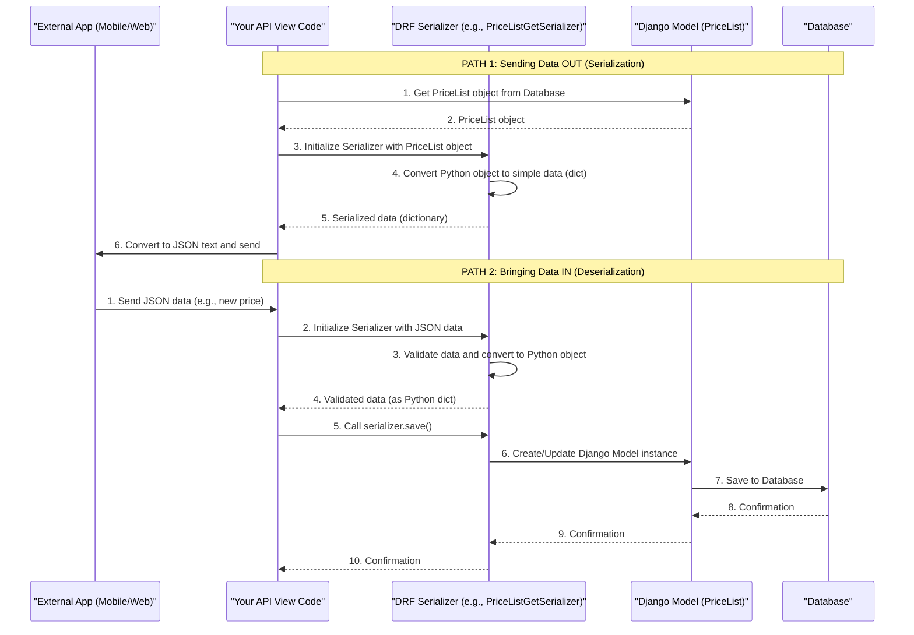
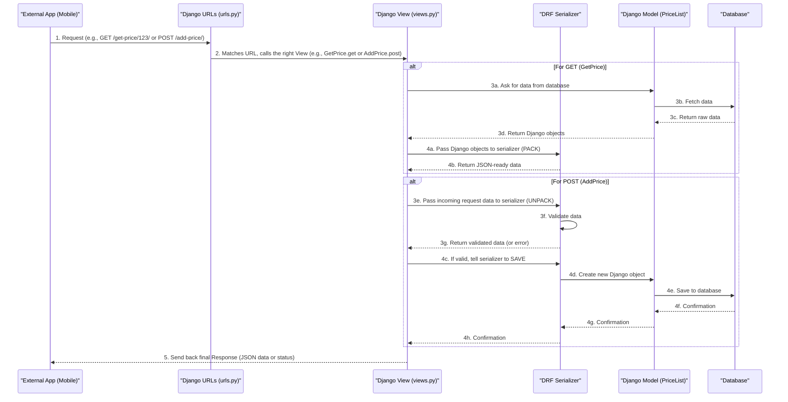
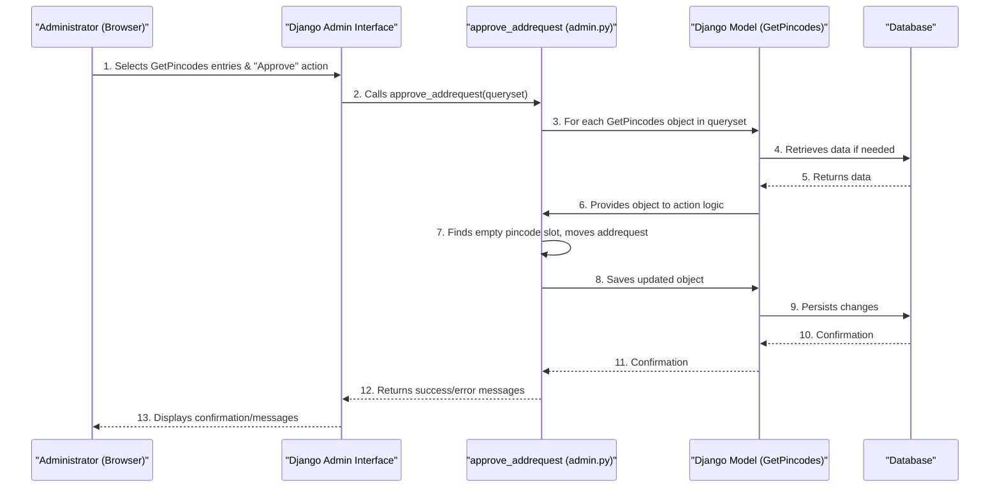

# Tutorial: document_dealer_details

This project, `document_dealer_details`, acts as a central hub for managing crucial information about **dealers**. It allows them to define *prices* for their products, request new *product categories*, upload important *documents*, and critically, manage their geographical *service areas* defined by pincodes. Administrators can easily oversee and approve these operations through a dedicated web interface, while various APIs enable other applications to interact with this data.


## Visual Overview



## Chapters

1. [Data Models
](document/01_data_models_.md)
2. [Dealer Pincode Management
](document/02_dealer_pincode_management_.md)
3. [Data Serialization
](document/03_data_serialization_.md)
4. [API Endpoints (Views & URLs)
](document/04_api_endpoints__views___urls__.md)
5. [Admin Interface Management
](document/05_admin_interface_management_.md)

---

<sub><sup>Generated by [AI Codebase Knowledge Builder](https://github.com/The-Pocket/Tutorial-Codebase-Knowledge).</sup></sub>


# Chapter 1: Data Models

Imagine you're building a system for a business that works with many different dealers. Each dealer might sell various items (like specific types of scrap metal), and they need to list their prices. You also need to keep track of important documents for each dealer (like their ID card or business license) and the specific areas (pincodes) where they offer their services.

How do you store all this information in an organized way so your computer program can easily find, update, and understand it? This is where **Data Models** come in!

## What are Data Models? (The Blueprint Analogy)

Think of a **Data Model** like a detailed blueprint for building something, like a house.

*   A house blueprint shows where the walls go, how many rooms there are, and what kind of doors and windows are needed.
*   In the same way, a **Data Model** is a blueprint for a specific type of information your application needs to store in its database. It tells your program exactly what kind of details each "item" will have and how different "items" are connected.

For our project, we have blueprints for things like:
*   **Price Lists**: To store details about an item's price and unit.
*   **Documents**: To store files like ID cards or business certificates.
*   **Pincodes**: To store the service areas for each dealer.

## Core Parts of a Data Model

Let's break down the main components of these blueprints.

### 1. Models (The Blueprint Itself)

In programming, each blueprint is defined as a "class" that inherits from `models.Model`. Each model represents a distinct "type" of data.

```python
# From dealer_details/models.py

from django.db import models

# This is a model! It's a blueprint for a "Price List" entry.
class PriceList(models.Model):
    # ... fields go here ...
```
This code snippet defines our `PriceList` model. It's the overall structure that holds information about a specific price for an item.

### 2. Fields (The Details on the Blueprint)

Inside each model, you define "fields." These are like the specific details on your house blueprint – for example, "number of bedrooms" or "type of roof."

For a `PriceList` model, fields would be things like `price` (how much?), `unit` (kg, pcs?), and `category_name` (what item?). Each field has a "type" (like text, number, date, or image) that tells the database what kind of information it expects.

Here are some examples of fields from our `PriceList` model:

```python
# From dealer_details/models.py (simplified example)
class PriceList(models.Model):
    category_name = models.CharField(max_length=250) # Text field for item name
    price = models.IntegerField()                     # Number field for price
    unit = models.CharField(max_length=3)             # Text field for unit (e.g., 'kg')
    created_date = models.DateTimeField(auto_now_add=True) # Date and time field
    # ... other fields ...
```
In this snippet:
*   `CharField` is used for text (like "Plastic Bottles" or "kg").
*   `IntegerField` is for whole numbers (like "250").
*   `DateTimeField` is for storing dates and times (like when the price was added).
These field types ensure that the data stored is always in the correct format.

### 3. Relationships (Connecting Blueprints)

Sometimes, one type of information needs to be linked to another. For example, a "Price List Entry" (our `PriceList` model) belongs to a specific "Dealer" (which is another blueprint called `DealerProfile`).

Data models allow us to define these connections using special fields called "relationships." The most common one is `ForeignKey`.

A `ForeignKey` field means "this piece of data is related to (or 'belongs to') an entry in another model."

Let's look at how our `PriceList` connects to a `DealerProfile`:

```python
# From dealer_details/models.py (simplified example)
# We need to import the DealerProfile model to link to it.
from accounts.models import DealerProfile

class PriceList(models.Model):
    # ... other fields ...
    dealer = models.ForeignKey(DealerProfile, on_delete=models.CASCADE)
    # This means each PriceList entry is linked to one specific DealerProfile.
```
Here, `dealer = models.ForeignKey(DealerProfile, ...)` tells our system that every `PriceList` entry must be associated with an existing `DealerProfile` (which is a blueprint for storing dealer details). `on_delete=models.CASCADE` is a rule that says if a `DealerProfile` is ever deleted, all its related `PriceList` entries should also be deleted automatically.

## Solving Our Use Case: Storing Price Lists

Let's say a dealer wants to add a new price for "Plastic Bottles" at "250 rupees per kg".
Using our `PriceList` model, we define the structure for this information.

**Here's the information we want to store:**
*   **Item**: Plastic Bottles
*   **Price**: 250
*   **Unit**: kg
*   **Dealer**: Dealer A (linked to their `DealerProfile`)
*   **Pincode**: 123456

**How the `PriceList` model helps:**
The `PriceList` model acts as a template. When you want to create a new price entry, you simply create a new "object" based on this blueprint and fill in the details for its fields.

```python
# Imagine this is happening in your program (very simplified)

# 1. We would first find the 'SubCategory' object for 'Plastic Bottles'
#    and the 'DealerProfile' object for 'Dealer A'.
#    (We're skipping the code for finding them for simplicity.)
# subcategory_object = ... # This holds details for Plastic Bottles
# dealer_object = ...      # This holds details for Dealer A

# 2. Now, we create a new PriceList entry:
# from dealer_details.models import PriceList # (This would be at the top of your file)

new_price_entry = PriceList(
    # Fields get their values from our desired input:
    subcategory_name='Plastic Bottles', # Text value
    price=250,                          # Number value
    unit='kg',                          # Text value
    dealer=dealer_object,               # Linked to the DealerProfile object
    pincode='123456'                    # Text value
    # Other fields (like category, GST) are often filled automatically
    # when you save, as defined in the model's 'save' method in models.py.
)

# 3. To save this entry into the database, you call the 'save()' method:
# new_price_entry.save()
```
After `new_price_entry.save()` is called, a new row is added to the `PriceList` table in your database, neatly storing all these details in their correct "columns" (fields).

## Under the Hood: How Data Models Work

When you create a model object and then use its `.save()` method to store data, here's a simple idea of what happens behind the scenes:



1.  **Your Application Code**: You write Python code to create a new `PriceList` object and assign values to its fields.
2.  **Django Model**: When you call `.save()`, the Django model acts like a smart assistant. It first checks if the data types are correct (e.g., `price` must be a number, `unit` must be text). It also prepares the data, automatically filling in things like `created_date`.
3.  **Database**: Finally, the Django model communicates with your database, telling it to add a new row of information according to the `PriceList` blueprint (table structure).

## Examples of Other Data Models in Our Project

Besides `PriceList`, our project uses other models to store different types of information, each with its own blueprint:

*   **`documents` Model**: This blueprint stores various files uploaded by a dealer, such as their Aadhar card, picture, or GST certificate. Notice how it uses `FileField` for documents.

    ```python
    # From dealer_details/models.py (simplified example)
    from django.db import models
    from django.core.validators import FileExtensionValidator

    class documents(models.Model):
        Aadhar_card = models.FileField( # Field for an Aadhar card file
            validators=[FileExtensionValidator(['png', 'jpg', 'jpeg', 'pdf'])],
            upload_to='documents/aadhar_card' # Folder where files are saved
        )
        Pic = models.ImageField(        # Field for a picture file
            validators=[FileExtensionValidator(['png', 'jpg', 'jpeg'])],
            upload_to='documents/Picture', null=True, blank=True
        )
        # ... other fields for different document types (e.g., GSTcertificate) ...
        status = models.CharField(max_length=12, default='INPROGRESS')
    ```
    The `documents` model uses `FileField` and `ImageField` to handle file uploads, specifying which file types are allowed. It also has a `status` field to track if a document is in progress, accepted, or canceled.

*   **`GetPincodes` Model**: This model stores the specific service areas (pincodes) a dealer operates in. You'll notice it has multiple `pincode` fields. This is an important model, and it will be the focus of our next chapter!

    ```python
    # From dealer_details/models.py (simplified example)
    from django.db import models
    from accounts.models import DealerProfile # To link to the dealer

    class GetPincodes(models.Model):
        dealer_id = models.ForeignKey(DealerProfile, on_delete=models.CASCADE)
        pincode1 = models.CharField(max_length=6, null=True, blank=True)
        pincode2 = models.CharField(max_length=6, null=True, blank=True)
        # ... up to pincode11 ...
        no_of_pincodes = models.IntegerField(default=5, null=True, blank=True)
    ```
    Just like `PriceList`, `GetPincodes` also uses a `ForeignKey` to link to a `DealerProfile`, ensuring we know exactly which dealer serves which pincodes.

## Conclusion

In this chapter, we learned that Data Models are like blueprints that define the structure of the information our application needs to store. We saw how models use "fields" to describe individual pieces of data and "relationships" (like `ForeignKey`) to connect different types of information. This structured approach helps our application keep track of everything from product prices to dealer documents in an organized and efficient way within a database.

Now that we understand how data is structured, let's dive into a specific example: how we manage the pincodes (service areas) for dealers using the `GetPincodes` model.

[Next Chapter: Dealer Pincode Management](document/02_dealer_pincode_management_.md)

---

<sub><sup>Generated by [AI Codebase Knowledge Builder](https://github.com/The-Pocket/Tutorial-Codebase-Knowledge).</sup></sub> <sub><sup>**References**: [[1]](https://github.com/snehabansal483/document_dealer_details/blob/3a6a056be89f90b25576832be3c4f2c44f3ea086/dealer_details/models.py)</sup></sub>


# Chapter 2: Dealer Pincode Management

In the [previous chapter](document/01_data_models_.md), we learned about **Data Models**, which are like blueprints for storing different kinds of information in our system. We saw models for price lists and documents. At the end, we briefly touched upon a model called `GetPincodes`.

This chapter is all about how we use that `GetPincodes` model to handle a very important aspect of our business: managing the specific service areas (called **pincodes**) where each dealer operates.

## The Problem: Knowing Where Dealers Work

Imagine you have many dealers, and each one covers specific areas defined by pincodes.
*   Dealer A covers pincode 123456 and 789012.
*   Dealer B covers pincode 987654.

How do we keep track of this information? What if a dealer wants to add a *new* pincode to their service area? Or remove one? Or update their whole list of service areas? Our system needs a smart way to manage these geographical boundaries.

This is where **Dealer Pincode Management** comes in!

**Our Central Use Case:** A dealer wants to expand their service to a new area and requests to add a new pincode. Our system needs to allow them to make this request, and then an administrator needs to approve it, adding the pincode to the dealer's approved list.

## The `GetPincodes` Model: Our Pincode Blueprint

Just like we have a blueprint for `PriceList` or `documents`, we have a special blueprint for dealer pincodes: the `GetPincodes` model.

Let's look at its core structure:

```python
# From dealer_details/models.py (simplified)
from django.db import models
from accounts.models import DealerProfile # To link to the dealer

class GetPincodes(models.Model):
    dealer_id = models.ForeignKey(DealerProfile, on_delete=models.CASCADE)
    pincode1 = models.CharField(max_length=6, null=True, blank=True)
    pincode2 = models.CharField(max_length=6, null=True, blank=True)
    # ... up to pincode11 ...
    addrequest = models.CharField(max_length=6, null=True, blank=True)
    no_of_pincodes = models.IntegerField(default=5, null=True, blank=True)
    # ... other fields for tracking dates ...
```

Think of this model as having:
*   **`dealer_id`**: This is a [relationship](document/01_data_models_.md) (`ForeignKey`) that links this pincode information to a specific `DealerProfile` (our dealer blueprint). It tells us *which* dealer this pincode entry belongs to.
*   **`pincode1` through `pincode11`**: These are like individual "slots" or "boxes" where we can store up to 11 different pincodes for a dealer. Why multiple fixed slots? This design choice provides a clear, structured way to store a set number of pincodes directly in the database.
*   **`addrequest`**: This is a special temporary "mailbox" field. When a dealer wants to add a *new* pincode, they send it to this mailbox. It waits here until an administrator reviews and approves it.
*   **`no_of_pincodes`**: This field simply keeps count of how many of the `pincode1` to `pincode11` slots are currently filled for a dealer. It's a quick way to know the total number of active pincodes without checking each slot individually.

## Solving Our Use Case: Requesting and Approving a Pincode

Let's walk through our use case: A dealer wants to add pincode `345678` to their service area.

### Step 1: Dealer Requests a New Pincode

When a dealer wants to add a new pincode, they can use an API (Application Programming Interface) call. Think of an API as a special button or form on a website that sends a message to our system.

The dealer will send their `dealer_id` and the `addrequest` (the new pincode).

```python
# Simplified example of what happens when a dealer requests a pincode
# This is handled by the RequesttoAddPincodes view in views.py

# Imagine a dealer with ID 123 wants to add pincode "345678"
dealer_id_to_update = 123
new_pincode_request = "345678"

# Our system finds the GetPincodes entry for this dealer
# and puts the new pincode into the 'addrequest' mailbox.
# This doesn't immediately add it to pincode1, pincode2, etc.
# It just holds the request.
# Example:
# pins_entry = GetPincodes.objects.get(dealer_id=dealer_id_to_update)
# pins_entry.addrequest = new_pincode_request
# pins_entry.save()
```
After this, the `addrequest` field for that dealer's `GetPincodes` entry will contain "345678".

### Step 2: Administrator Approves the Request

Now, the `addrequest` field is like a flag for the administrator. An administrator needs to go into the system's backend (the admin interface) and approve this request.

When the administrator approves it, our system automatically finds an *empty* pincode slot (`pincode1` through `pincode11`), moves the value from `addrequest` into that empty slot, clears the `addrequest` mailbox, and updates the `no_of_pincodes` count.

Let's see an example of a `GetPincodes` entry **before** and **after** approval:

| Field           | Before Approval (Dealer ID 123) | After Approval (Dealer ID 123) |
| :-------------- | :------------------------------ | :----------------------------- |
| `dealer_id`     | `123`                           | `123`                          |
| `pincode1`      | `100001`                        | `100001`                       |
| `pincode2`      | `200002`                        | `200002`                       |
| `pincode3`      | `None`                          | `345678`                       |
| `pincode4`      | `None`                          | `None`                         |
| ...             | ...                             | ...                            |
| `addrequest`    | `345678`                        | `None`                         |
| `no_of_pincodes` | `2`                             | `3`                            |

Notice how `pincode3` went from `None` (empty) to `345678`, `addrequest` was cleared, and `no_of_pincodes` increased!

## Under the Hood: How Pincode Management Works

Let's peek behind the scenes to see how our system handles these requests and approvals.

### The Journey of a Pincode Request and Approval



1.  **Dealer Sends Request**: The dealer uses their application (or an API call) to send their `dealer_id` and the new pincode they want to add.
2.  **API Receives Request**: A special part of our Django application, called an API "view" (specifically `RequestToAddPincodes` in `views.py`), receives this request.
3.  **Model Updates `addrequest`**: The view finds the correct `GetPincodes` entry for that dealer in the database and updates its `addrequest` field with the new pincode. It doesn't put it into `pincode1`, `pincode2`, etc., yet.
4.  **Admin Reviews**: An administrator logs into the Django Admin Panel (a special interface to manage data). They see the `GetPincodes` entries and notice the ones with `addrequest` values.
5.  **Admin Approves**: The administrator selects the entry and uses a special "action" (called `approve_addrequest` in `admin.py`).
6.  **Action Logic**: This action's code runs. It looks at the selected `GetPincodes` entry. It goes through `pincode1`, `pincode2`, etc., trying to find the *first empty slot*.
7.  **Fill Slot & Clear Request**: Once an empty slot is found, the value from `addrequest` is moved into that slot. The `addrequest` field is then cleared (set back to `None`).
8.  **Update Count**: The `no_of_pincodes` field is recalculated by counting how many `pincode` slots are now filled.
9.  **Save to Database**: Finally, the updated `GetPincodes` entry is saved back to the database. The new pincode is now officially part of the dealer's service area!

### Code Snippets Explained

Let's look at the actual code that makes this happen:

#### 1. The `GetPincodes` Model (Blueprint) Revisited

```python
# From dealer_details/models.py
class GetPincodes(models.Model):
    dealer_id = models.ForeignKey(DealerProfile, on_delete=models.CASCADE)
    pincode1 = models.CharField(max_length=6, null=True, blank=True)
    pincode2 = models.CharField(max_length=6, null=True, blank=True)
    pincode3 = models.CharField(max_length=6, null=True, blank=True)
    pincode4 = models.CharField(max_length=6, null=True, blank=True)
    pincode5 = models.CharField(max_length=6, null=True, blank=True)
    pincode6 = models.CharField(max_length=6, null=True, blank=True)
    pincode7 = models.CharField(max_length=6, null=True, blank=True)
    pincode8 = models.CharField(max_length=6, null=True, blank=True)
    pincode9 = models.CharField(max_length=6, null=True, blank=True)
    pincode10 = models.CharField(max_length=6, null=True, blank=True)
    pincode11 = models.CharField(max_length=6, null=True, blank=True)
    addrequest = models.CharField(max_length=6, null=True, blank=True)
    no_of_pincodes = models.IntegerField(default=5, null=True, blank=True)
    # ... created_at and updated_at fields ...
```
This is the blueprint we discussed. It clearly defines the fixed 11 slots for pincodes, the `addrequest` field for pending requests, and `no_of_pincodes` to track the count. `null=True, blank=True` means these fields can be empty in the database.

#### 2. Dealer Requesting Pincode (API View)

```python
# From dealer_details/views.py (simplified)
class RequestToAddPincodes(APIView):
    serializer_class = RequesttoAddPincodesSerializer # Helper for data formatting

    def post(self, request):
        dealer_id = request.data['dealer_id']
        addrequest = request.data['addrequest'] # The new pincode from the dealer

        # Find the dealer's pincode entry in the database
        pins = GetPincodes.objects.get(dealer_id=dealer_id)

        if pins.addrequest is None: # Is the 'mailbox' empty?
            pins.addrequest = addrequest # Put the new pincode in the mailbox
            pins.save() # Save the change to the database
            return Response({'success': 'Request submitted!'})
        else:
            return Response({'Not Acceptable': 'Request pending, please wait.'})
```
This code shows how `RequestToAddPincodes` handles a request. It checks if there's already a pending request in the `addrequest` field. If not, it places the new pincode there and saves it. This is how the dealer's request is recorded.

#### 3. Administrator Approval (Admin Action)

This is the most crucial part of the approval process. It lives in `dealer_details/admin.py` and is a special function that the administrator can run from the Django admin interface.

```python
# From dealer_details/admin.py (simplified)
from django.contrib import messages
from django.contrib import admin
from dealer_details.models import GetPincodes # Import our model

@admin.action(description='Approve Addrequest and Add Pincode(s)')
def approve_addrequest(modeladmin, request, queryset):
    for obj in queryset: # Loop through each selected GetPincodes entry
        if obj.addrequest: # Is there a pending request in the 'mailbox'?
            new_pins = obj.addrequest.split(',') # In case multiple were requested
            new_pins = [pin.strip() for pin in new_pins if pin.strip().isdigit()]

            # List of all our pincode slots
            pincode_fields = ['pincode1', 'pincode2', 'pincode3', 'pincode4',
                              'pincode5', 'pincode6', 'pincode7', 'pincode8',
                              'pincode9', 'pincode10', 'pincode11']

            index = 0
            for i in range(len(current_pins)):
                # Find the first empty slot and fill it
                if getattr(obj, pincode_fields[i]) in [None, ''] and index < len(new_pins):
                    setattr(obj, pincode_fields[i], new_pins[index])
                    index += 1

            obj.addrequest = None # Clear the 'mailbox' after processing
            
            # Recalculate the total number of pincodes
            obj.no_of_pincodes = sum(1 for field in pincode_fields if getattr(obj, field))
            obj.save() # Save all changes to the database
            messages.success(request, f"{obj.dealer_id}: Pincode(s) added.")
        else:
            messages.warning(request, f"{obj.dealer_id}: No addrequest to process.")

# Register the model with the admin panel and add our custom action
class GetPincodesAdmin(admin.ModelAdmin):
    list_display = ('id', 'dealer_id', 'addrequest', 'pincode1', 'no_of_pincodes') # Show these fields
    actions = [approve_addrequest] # Make our action available

admin.site.register(GetPincodes, GetPincodesAdmin)
```
This powerful code snippet is the core of the approval process.
*   `@admin.action`: This decorator turns `approve_addrequest` into a callable action from the admin panel.
*   `for obj in queryset`: Allows the admin to select and process multiple `GetPincodes` entries at once.
*   `pincode_fields`: This list contains the names of all our pincode slots.
*   `getattr(obj, field)` and `setattr(obj, field, value)`: These are Python functions that let us get or set the value of a field on an object using its name (like `obj.pincode1` is the same as `getattr(obj, 'pincode1')`).
*   The `for` loop checks each `pincodeX` field. If it's empty, it fills it with the new pincode from `addrequest`.
*   `obj.addrequest = None`: Clears the request.
*   `obj.no_of_pincodes = sum(...)`: Recalculates the count by checking how many `pincodeX` fields are *not* empty.
*   `obj.save()`: Saves all these changes back to the database.

#### 4. Updating All Pincodes (Full Update)

Sometimes, a dealer might want to completely change their set of pincodes, not just add one.
```python
# From dealer_details/views.py (simplified)
class UpdatePincodes(APIView):
    serializer_class = UpdatePincodesSerializer

    def post(self, request):
        dealer_id = request.data.get('dealer_id')
        
        # Get pincode values from the request, they could be None if not provided
        p1 = request.data.get('pincode1')
        p2 = request.data.get('pincode2')
        # ... up to pincode11 ...

        pins = GetPincodes.objects.get(dealer_id=dealer_id)
        
        # Directly update each pincode slot with the new values
        pins.pincode1 = p1
        pins.pincode2 = p2
        # ... and so on for all 11 pincodes ...

        pins.save() # Save changes
        return Response({'success': 'Pincodes updated successfully!'})
```
This view allows a dealer (or an admin) to send a full list of pincodes, and the system will simply overwrite the existing `pincode1` through `pincode11` slots with the new values. This offers flexibility for full updates.

#### 5. Tracking the Number of Pincodes (Count)

```python
# From dealer_details/views.py (simplified)
class No_of_pincodes(APIView):
    def get(self, request, dealer_id):
        pins = GetPincodes.objects.get(dealer_id=dealer_id)
        
        # Manually count filled pincode slots
        pin_nos = 0
        if pins.pincode1: pin_nos += 1
        if pins.pincode2: pin_nos += 1
        # ... check all 11 pincodes ...

        pins.no_of_pincodes = pin_nos # Update the count field
        pins.save() # Save the updated count
        return Response({'total_pincodes': pin_nos})
```
This view calculates the total number of non-empty pincode slots for a dealer and updates the `no_of_pincodes` field in the database. While the `approve_addrequest` action also updates this, this specific view ensures the count is always accurate, even if pincodes are changed directly (e.g., via `UpdatePincodes`).

## Conclusion

In this chapter, we explored how our system manages dealer pincodes using the `GetPincodes` model. We learned about its various fields, including the fixed pincode slots, the `addrequest` "mailbox" for new requests, and the `no_of_pincodes` counter. We saw how a dealer can request a new pincode and how an administrator can approve it, automatically filling an available slot. This system ensures dealers operate within defined regions and provides a clear process for expanding their service areas.

Now that we understand how data is structured and how pincodes are managed, the next step is to understand how this data is prepared for sending over the internet and for displaying in various applications.

[Next Chapter: Data Serialization](document/03_data_serialization_.md)

---

<sub><sup>Generated by [AI Codebase Knowledge Builder](https://github.com/The-Pocket/Tutorial-Codebase-Knowledge).</sup></sub> <sub><sup>**References**: [[1]](https://github.com/snehabansal483/document_dealer_details/blob/3a6a056be89f90b25576832be3c4f2c44f3ea086/dealer_details/admin.py), [[2]](https://github.com/snehabansal483/document_dealer_details/blob/3a6a056be89f90b25576832be3c4f2c44f3ea086/dealer_details/models.py), [[3]](https://github.com/snehabansal483/document_dealer_details/blob/3a6a056be89f90b25576832be3c4f2c44f3ea086/dealer_details/serializers.py), [[4]](https://github.com/snehabansal483/document_dealer_details/blob/3a6a056be89f90b25576832be3c4f2c44f3ea086/dealer_details/views.py)</sup></sub>


# Chapter 3: Data Serialization

In the [previous chapter](document/02_dealer_pincode_management_.md), we learned how our system uses **Data Models** (like `GetPincodes`) to store and manage important information, such as which pincodes a dealer covers. We saw how this data lives neatly organized within our Django application and its database.

But what happens when this carefully organized data needs to leave our application? Or when data from the outside world (like a mobile app) needs to come *into* our application?

Imagine you're building a mobile app for dealers. This app needs to:
1.  **Display a dealer's current price list.**
2.  **Allow a dealer to add a new price for an item.**

Our Django models (like `PriceList` or `GetPincodes`) are complex Python "objects." They understand things like `ForeignKey` relationships and specific field types (e.g., `CharField`, `IntegerField`). However, a mobile app or a web browser doesn't understand these complex Python objects directly. They usually expect data in a simple, universally understood format, like **JSON** (JavaScript Object Notation), which looks like plain text with `{}` and `[]`.

This is where **Data Serialization** comes to the rescue!

## What is Data Serialization? (The Universal Translator Analogy)

Think of **Data Serialization** as having a **universal translator** for your application's data, or like **packing and unpacking a suitcase for travel.**

*   **Serialization (Packing)**: This is the process of taking complex data (like our Django `PriceList` Python objects) and converting them into a simple, standardized format (like a JSON string) that can be easily sent over the internet. It's like packing your clothes neatly into a suitcase so they can travel safely.

    *   **From:** `PriceList` object (Python)
    *   **To:** JSON string (Plain text)

*   **Deserialization (Unpacking)**: This is the reverse process. When data comes into our application (e.g., a new price entered by a user from a mobile app, sent as a JSON string), deserializers translate it back into complex Django model objects. They also make sure the data is valid and fits the expected structure *before* it's saved to our database. It's like unpacking your suitcase and putting your clothes back in your wardrobe.

    *   **From:** JSON string (Plain text)
    *   **To:** `PriceList` object (Python)

In short:
*   **Serialization** is for **sending data OUT** of your Django application.
*   **Deserialization** is for **bringing data IN** to your Django application.

## How Django REST Framework (DRF) Helps with Serialization

Our project uses a powerful tool called **Django REST Framework (DRF)**. DRF provides special classes called **Serializers** that handle all this packing and unpacking automatically for us. They bridge the gap between our complex Django models and simple data formats like JSON.

## Solving Our Use Case: Displaying a Price List

Let's use our first problem: **displaying a dealer's current price list in a mobile app.**

We have `PriceList` objects in our database. We need to convert them into JSON to send to the mobile app.

We use a Serializer for this, specifically `PriceListGetSerializer` from `dealer_details/serializers.py`.

```python
# From dealer_details/serializers.py (simplified)
from rest_framework import serializers
from .models import PriceList # Our PriceList blueprint

class PriceListGetSerializer(serializers.ModelSerializer):
    class Meta:
        model = PriceList # Tell the serializer which model to use
        fields = '__all__' # Include ALL fields from the PriceList model
```

**Explanation:**
*   `serializers.ModelSerializer`: This is a special type of serializer that knows how to automatically map fields from a Django model. It's a huge time-saver!
*   `class Meta`: This nested class is where we tell the serializer important details.
    *   `model = PriceList`: We specify that this serializer is built for our `PriceList` model.
    *   `fields = '__all__'`: This tells the serializer to include every field that exists in the `PriceList` model when converting it to JSON.

**Example: Serialization in Action (Outputting Data)**

Imagine we have a `PriceList` object in Django like this (conceptual, not actual Python code here):

```
PriceList Object:
  id: 1
  subcategory: "Plastic Bottles"
  dealer: <DealerProfile object for Dealer A>
  pincode: "123456"
  price: 250
  unit: "kg"
  created_date: "2023-10-27T10:00:00Z"
```

When we pass this `PriceList` object through `PriceListGetSerializer`, it gets converted into a JSON string:

```json
{
    "id": 1,
    "subcategory": "Plastic Bottles",
    "dealer": 123,  // Often just the ID of the linked object
    "pincode": "123456",
    "price": 250,
    "unit": "kg",
    "created_date": "2023-10-27T10:00:00Z"
}
```
This JSON is plain text that any mobile app or web browser can easily understand and display!

## Solving Our Use Case: Adding a New Price Entry

Now for the second problem: **allowing a dealer to add a new price for an item from a mobile app.**

The mobile app will send data (e.g., item name, price, pincode) as a JSON string. We need to convert this JSON back into a `PriceList` Python object, validate it, and then save it to our database. This is **deserialization**.

We use another serializer for this, `PriceListPostSerializer`.

```python
# From dealer_details/serializers.py (simplified)
from rest_framework import serializers
from .models import PriceList # Our PriceList blueprint

class PriceListPostSerializer(serializers.ModelSerializer):
    class Meta:
        model = PriceList
        fields = ('subcategory', 'dealer', 'pincode', 'price') # Only these fields for input
```

**Explanation:**
Notice that `fields` here is a specific list `('subcategory', 'dealer', 'pincode', 'price')`. This is because when creating a *new* item, we only need these essential pieces of information from the user. Other fields, like `id` or `created_date`, are usually generated automatically by Django or the database.

**Example: Deserialization in Action (Inputting Data)**

Imagine a mobile app sends this JSON to our Django application:

```json
{
    "subcategory": "Scrap Metal",
    "dealer": 456, // The ID of the dealer
    "pincode": "998877",
    "price": 150
}
```

Here's how our Django application uses `PriceListPostSerializer` to process this:

```python
# Imagine this code is in an API "view" (Chapter 4 will cover these!)
# from dealer_details.serializers import PriceListPostSerializer

# 1. Get the raw JSON data from the incoming request
# request_data = {
#     "subcategory": "Scrap Metal",
#     "dealer": 456,
#     "pincode": "998877",
#     "price": 150
# }

# 2. Create a serializer instance with the incoming data
serializer = PriceListPostSerializer(data=request_data)

# 3. Validate the data (e.g., is 'price' a number? Is 'dealer' a valid ID?)
if serializer.is_valid():
    # 4. If valid, convert to a PriceList object and save to database
    new_price_entry = serializer.save()
    # new_price_entry is now a PriceList object saved in the database!
    # ... return success message ...
else:
    # ... return error messages based on validation failures ...
    pass
```

**What happens here:**
1.  We give the incoming `request_data` (our JSON) to `PriceListPostSerializer`.
2.  `serializer.is_valid()`: This is crucial! The serializer automatically checks if all the data types are correct (e.g., `price` is a number, `pincode` is text) and if all required fields are present. If anything is wrong, it won't be valid and will provide error messages.
3.  `serializer.save()`: If the data passes all validation checks, this method creates a *new* `PriceList` object in memory and then saves it as a new row in our database.

This entire process ensures that only correct and properly structured data makes it into our database.

## Under the Hood: The Serialization Journey

Let's visualize the journey of data through a serializer.



### Path 1: Sending Data Out (Serialization)
1.  **Your API View Code** asks the **Django Model** to fetch some data (e.g., a `PriceList` object) from the **Database**.
2.  The `PriceList` **Django Model** (a Python object) is returned to **Your API View Code**.
3.  **Your API View Code** passes this `PriceList` object to a **DRF Serializer** (like `PriceListGetSerializer`).
4.  The **DRF Serializer** takes the complex Python object and converts it into a simpler Python dictionary.
5.  The **DRF Serializer** returns this simple dictionary to **Your API View Code**.
6.  **Your API View Code** then takes this dictionary, converts it into a JSON text string, and sends it to the **External App**.

### Path 2: Bringing Data In (Deserialization)
1.  An **External App** sends JSON data (e.g., for a new price) to **Your API View Code**.
2.  **Your API View Code** initializes a **DRF Serializer** (like `PriceListPostSerializer`) with this incoming JSON data.
3.  The **DRF Serializer** validates the incoming data (checks types, required fields, etc.) and, if valid, converts it into a Python object (but not yet a full Django model instance).
4.  The **DRF Serializer** signals to **Your API View Code** that the data is valid.
5.  **Your API View Code** then calls `serializer.save()`.
6.  The **DRF Serializer** uses the validated data to create or update a **Django Model** instance.
7.  The **Django Model** then saves this new or updated data to the **Database**.
8.  The **Database** confirms the save.
9.  The **Django Model** confirms to the **DRF Serializer**.
10. The **DRF Serializer** confirms to **Your API View Code** that the operation was successful.

## Other Serializers in Our Project

Just like `PriceListGetSerializer` and `PriceListPostSerializer`, our project uses many other serializers in `dealer_details/serializers.py` for different data models and purposes:

*   **`DocumentsSerializer` / `GetDocumentsSerializer`**: Used for sending and receiving dealer document details. Since documents involve file uploads, these serializers handle that complexity.
*   **`AddPincodesSerializer`**: Used for specifying which pincodes a dealer covers.
*   **`RequesttoAddPincodesSerializer`**: Specifically handles the `addrequest` field we saw in the [Dealer Pincode Management chapter](document/02_dealer_pincode_management_.md), allowing a dealer to request a new pincode.
*   **`GetallPincodesSerializer`**: Used to send *all* pincode details for a dealer (including `pincode1` through `pincode11` and `addrequest`).
*   **`UpdatePincodesSerializer`**: Used when a dealer (or admin) wants to update their full list of pincodes directly.

Each of these serializers serves as a dedicated translator for a specific piece of information, ensuring that data is correctly packed and unpacked for its journey between our Django application and other systems.

## Conclusion

In this chapter, we unpacked the concept of **Data Serialization**. We learned that it's the crucial process of converting complex Django model objects into simple, universal formats (like JSON) for sending data out, and converting those simple formats back into Django objects for bringing data in. Django REST Framework's **Serializers** act as our universal translators, handling this packing, unpacking, and validation efficiently.

Now that we understand how data is prepared for travel, the next logical step is to see how this data actually travels – through **API Endpoints**, which are like the specific addresses or routes that data takes.

[Next Chapter: API Endpoints (Views & URLs)](document/04_api_endpoints__views___urls__.md)

---

<sub><sup>Generated by [AI Codebase Knowledge Builder](https://github.com/The-Pocket/Tutorial-Codebase-Knowledge).</sup></sub> <sub><sup>**References**: [[1]](https://github.com/snehabansal483/document_dealer_details/blob/3a6a056be89f90b25576832be3c4f2c44f3ea086/dealer_details/serializers.py)</sup></sub>


# Chapter 4: API Endpoints (Views & URLs)

In the [previous chapter](document/03_data_serialization_.md), we learned about **Data Serialization**, which is like packing and unpacking our application's data (such as a dealer's price list or document details) so it can travel easily over the internet in formats like JSON.

But once our data is "packed" (serialized) and ready, how does it actually get sent to a mobile app or another service? And how does our application *receive* new data from them? This is where **API Endpoints** come into play!

## The Problem: How Do Programs Talk to Each Other?

Imagine our Django application is a restaurant kitchen. We have our ingredients (data models like `PriceList`), and we know how to prepare dishes (serialization). But how do customers (other programs like mobile apps) order food or pick it up? They need a menu and a service window!

If a mobile app wants to:
1.  **Get a list of prices** for a specific dealer.
2.  **Add a new price** for an item.

How does it tell our Django application what it wants to do and where to send the information?

This is precisely what **API Endpoints** solve! They provide the "menu" and "service windows" for your application.

## What are API Endpoints? (The Restaurant Analogy)

Think of API Endpoints as a **menu of services** your application offers to other programs.

*   **URLs (The Addresses)**: These are like the **unique addresses** for each service on your menu. For example, `/add-price/` is where you go to add a new price, and `/get-documents/` is where you get documents. They tell the system *where* to find a specific service.
*   **Views (The Workers)**: These are the **actual workers** (or chefs in our kitchen) behind these addresses. When a request arrives at a URL, the corresponding view performs the necessary actions. For example, the "Add Price" view might take the new price data, save it to the database, and then tell you if it was successful.

In short: A **URL** is the path you type, and a **View** is the code that runs when you visit that path. Together, they form an **API Endpoint**.

## Solving Our Use Case: Getting and Adding Prices

Let's use our problem: a mobile app wants to **get** a dealer's price list and **add** a new price entry.

### 1. URLs: Setting Up the Addresses (`dealer_details/urls.py`)

First, we need to define the "addresses" or "paths" that other applications can use. These are set up in a file named `urls.py` inside our `dealer_details` application.

```python
# From dealer_details/urls.py (simplified)
from django.urls import path
from .views import * # Import all our "workers" (views)

urlpatterns = [
    # Address to add a new price
    path('add-price/', AddPrice.as_view(), name='add-price'),

    # Address to get prices for a specific dealer
    # <dealer_id> means this part of the address will change (e.g., /get-price/123/)
    path('get-price/<dealer_id>/', GetPrice.as_view(), name='get-price'),
]
```

**Explanation:**
*   `path('add-price/', ...)`: This means if someone visits `/add-price/` on our server, a specific action should happen.
*   `AddPrice.as_view()`: This tells Django which "worker" (or **View**) to call when the `/add-price/` address is accessed. We'll look at `AddPrice` next!
*   `<dealer_id>`: This is a placeholder. It means that the `dealer_id` part of the URL (e.g., `123` in `/get-price/123/`) will be captured and sent to the `GetPrice` view so it knows *which* dealer's prices to fetch.
*   `name='add-price'`: This gives a convenient name to our URL pattern, which is useful within our Django project.

### 2. Views: The Workers Behind the Addresses (`dealer_details/views.py`)

Now, let's look at the "workers" that actually do the job when a URL is accessed. These are defined in `views.py`.

#### A. `GetPrice` View (To get a dealer's prices)

This worker handles requests to the `/get-price/<dealer_id>/` address. It's designed to *receive* a request (usually a `GET` request, like asking for information) and *send back* the price list.

```python
# From dealer_details/views.py (simplified)
from rest_framework.views import APIView # Our powerful base for views
from rest_framework.response import Response # To send back replies
from .serializers import PriceListGetSerializer # Our data "packer"
from .models import PriceList # Our PriceList "blueprint"

class GetPrice(APIView):
    def get(self, request, dealer_id): # This method runs for GET requests
        # 1. Find the prices for this specific dealer in the database
        prices = PriceList.objects.filter(dealer_id=dealer_id)

        # 2. Use our serializer (from Chapter 3) to "pack" the data
        #    'many=True' because we expect multiple price entries
        serializer = PriceListGetSerializer(prices, many=True)

        # 3. Send back the "packed" data as a response
        return Response(serializer.data)
```

**Explanation:**
*   `class GetPrice(APIView):`: `APIView` is a special class from Django REST Framework that makes it easy to build API workers.
*   `def get(self, request, dealer_id):`: This method will be called when a `GET` request (like browsing a website or asking for data) comes to the `/get-price/<dealer_id>/` URL.
    *   `request`: Contains all the details about the incoming request.
    *   `dealer_id`: This is the value captured from the URL (e.g., `123`).
*   `PriceList.objects.filter(...)`: This is how we talk to our [Data Models](document/01_data_models_.md) to get specific information from the database.
*   `PriceListGetSerializer(...)`: We use our "packer" from [Data Serialization](document/03_data_serialization_.md) to turn the complex Django objects into simple data (JSON).
*   `return Response(serializer.data)`: This sends the JSON data back to the mobile app or wherever the request came from.

**Example Request & Response:**

*   **Request (from mobile app):** `GET /get-price/123/` (Mobile app wants prices for dealer ID 123)
*   **Response (from our API):**
    ```json
    [
        {
            "id": 1,
            "subcategory": "Plastic Bottles",
            "dealer": 123,
            "pincode": "123456",
            "price": 250,
            "unit": "kg"
        },
        {
            "id": 2,
            "subcategory": "Cardboard",
            "dealer": 123,
            "pincode": "123456",
            "price": 100,
            "unit": "kg"
        }
    ]
    ```
    The mobile app receives this JSON and can easily display it.

#### B. `AddPrice` View (To add a new price entry)

This worker handles requests to the `/add-price/` address. It's designed to *receive* data (usually a `POST` request, like submitting a form) and *save* it.

```python
# From dealer_details/views.py (simplified)
from rest_framework.views import APIView
from rest_framework.response import Response
from rest_framework import status # For HTTP status codes (like success/error)
from .serializers import PriceListPostSerializer # Our data "unpacker"

class AddPrice(APIView):
    serializer_class = PriceListPostSerializer # Tell the view which serializer to use
    
    def post(self, request): # This method runs for POST requests
        # 1. Take the incoming data and pass it to our serializer ("unpacker")
        serializer = PriceListPostSerializer(data=request.data)

        # 2. Check if the data is valid (e.g., correct types, required fields)
        if serializer.is_valid(raise_exception=True): # If not valid, it automatically sends an error
            # 3. If valid, "unpack" the data and save it as a new PriceList entry
            serializer.save() 
            
            # 4. Send back a success message or the saved data
            return Response(serializer.data, status=status.HTTP_201_CREATED) # 201 means "Created"
```

**Explanation:**
*   `def post(self, request):`: This method will be called when a `POST` request (like submitting a form with new data) comes to the `/add-price/` URL.
*   `serializer = PriceListPostSerializer(data=request.data)`: We give the incoming data (`request.data`) to our "unpacker" from [Data Serialization](document/03_data_serialization_.md).
*   `serializer.is_valid(raise_exception=True)`: This is where the serializer validates the data. If the data is missing something or has the wrong format, it will automatically send an error response.
*   `serializer.save()`: If the data is valid, this crucial line takes the validated data and saves it as a new `PriceList` object in our database.
*   `return Response(serializer.data, status=status.HTTP_201_CREATED)`: We send back the newly saved data and an HTTP status code `201 Created` to confirm success.

**Example Request & Response:**

*   **Request (from mobile app):** `POST /add-price/` (Mobile app wants to add a new price)
    *   **Body (JSON data being sent):**
        ```json
        {
            "subcategory": "New Item Type",
            "dealer": 456,
            "pincode": "998877",
            "price": 500
        }
        ```
*   **Response (from our API):**
    ```json
    {
        "id": 3,
        "subcategory": "New Item Type",
        "dealer": 456,
        "pincode": "998877",
        "price": 500,
        "unit": "pcs", // Unit might be auto-filled by the model
        "created_date": "2023-10-27T11:30:00Z"
    }
    ```
    And now, a new entry for "New Item Type" is saved in our database!

## Under the Hood: The Journey Through an API Endpoint

Let's visualize the entire process from an external application's request to our database and back.



1.  **External App Makes Request**: A mobile app or another service sends a request (like `GET` for information or `POST` to send new data) to a specific URL on our server.
2.  **Django URLs Match**: Our `urls.py` file acts like a router. It looks at the incoming URL and figures out which `View` (worker) is responsible for handling it.
3.  **Django View Processes Request**:
    *   **For `GET` requests (like `GetPrice`):** The View asks the [Django Model](document/01_data_models_.md) to get data from the database. Once it has the data (as Python objects), it gives them to a [DRF Serializer](document/03_data_serialization_.md) to "pack" them into a simple, JSON-ready format.
    *   **For `POST` requests (like `AddPrice`):** The View takes the incoming data from the request and gives it to a [DRF Serializer](document/03_data_serialization_.md) to "unpack" and validate it. If the data is valid, the serializer saves it as a new entry in our database.
4.  **Response Sent Back**: Finally, the `View` sends a `Response` back to the external application, containing the requested data (for `GET`) or a confirmation message (for `POST`).

## Other API Endpoints in Our Project

Our project has many more API Endpoints defined in `dealer_details/urls.py` and implemented in `dealer_details/views.py`, each serving a specific purpose:

*   **`add_documents/` and `get_documents/<dealer_id>/`**: For handling dealer document uploads and retrievals.
*   **`add_pincodes/` and `update_pincodes/`**: For initial setup and full updates of a dealer's service pincodes.
*   **`request_to_add_pincodes/`**: As seen in [Dealer Pincode Management](document/02_dealer_pincode_management_.md), this is the endpoint where dealers submit a request to add a new pincode to their list.
*   **`get_all_pincodes/<dealer_id>/`**: To fetch all pincode information for a dealer.
*   **`search-subcategory/<pincode>/`**: An endpoint to find what subcategories are available in a specific pincode.

Each of these `path` entries in `urls.py` points to a corresponding `APIView` (or a similar view type) in `views.py`, allowing different parts of our system to communicate effectively with the outside world.

## Conclusion

In this chapter, we learned that **API Endpoints** are the gateways for other programs to interact with our Django application. We discovered that **URLs** provide the unique addresses for these services, and **Views** are the Python code that performs the necessary actions when those addresses are visited. We saw how they work together to fetch data, receive new data, and send back responses, all while leveraging our previously learned concepts of [Data Models](document/01_data_models_.md) and [Data Serialization](document/03_data_serialization_.md).

Now that we understand how our application communicates, let's explore how administrators can manage and interact with all this data directly through a user-friendly interface.

[Next Chapter: Admin Interface Management](document/05_admin_interface_management_.md)

---

<sub><sup>Generated by [AI Codebase Knowledge Builder](https://github.com/The-Pocket/Tutorial-Codebase-Knowledge).</sup></sub> <sub><sup>**References**: [[1]](https://github.com/snehabansal483/document_dealer_details/blob/3a6a056be89f90b25576832be3c4f2c44f3ea086/dealer_details/urls.py), [[2]](https://github.com/snehabansal483/document_dealer_details/blob/3a6a056be89f90b25576832be3c4f2c44f3ea086/dealer_details/views.py)</sup></sub>


# Chapter 5: Admin Interface Management

In the [previous chapter](document/04_api_endpoints__views___urls__.md), we explored **API Endpoints**, which are like the special service windows that allow different computer programs (like a mobile app) to talk to our Django application. They send and receive data in structured formats like JSON.

But what if you, as the person managing the application, need to look at the data directly? What if you want to quickly see all the dealers, edit a price, check if a document was uploaded, or approve a pending request, all without writing or running any Python code?

This is where the **Admin Interface Management** comes in!

## The Problem: Managing Data Without Code

Imagine you are the administrator of our `document_dealer_details` application.
*   A dealer has requested to add a new pincode, and you need to **approve** it.
*   You want to quickly **check** if a dealer's ID document has been uploaded.
*   You need to **edit** a mistake in a price list entry.

How do you perform these tasks without having to write a new API endpoint, or using complex database commands?

This is exactly what the Django **Admin Interface** solves! It provides a built-in, ready-to-use control panel for your application.

**Our Central Use Case:** An administrator needs to easily approve a new pincode request submitted by a dealer, similar to what we discussed in [Dealer Pincode Management](document/02_dealer_pincode_management_.md).

## What is the Django Admin Interface? (The Control Panel Analogy)

Think of the Django **Admin Interface** as a **dedicated control panel** for your application's database.

*   It's a web-based, graphical user interface (GUI), meaning you interact with it using your mouse and keyboard in a web browser, not by typing code.
*   It lets you easily **view, add, edit, and delete** data directly from your database.
*   It's like a special backend website just for administrators to manage all the information that your application stores.

By default, Django comes with this powerful admin panel. To make our own data (like `PriceList` or `GetPincodes`) appear in this panel, we just need to "register" our data models.

## How to Manage Data in the Admin Interface

To make our data models appear in the admin panel and customize how they look and behave, we work with a special file: `dealer_details/admin.py`.

### Step 1: Making Your Data Models Visible (`admin.site.register`)

The first thing we need to do is tell Django's admin panel about our models. This is called "registering" them.

```python
# From dealer_details/admin.py
from django.contrib import admin
from dealer_details.models import PriceList, GetPincodes, add_category, documents

# Register your models here.
admin.site.register(PriceList)
admin.site.register(GetPincodes)
admin.site.register(add_category)
admin.site.register(documents)
```
After this code is in `admin.py` and your server is running, if you log into your Django admin panel (usually at `yourwebsite.com/admin/`), you will see `PriceList`, `GetPincodes`, `add_category`, and `documents` listed as clickable items. Clicking on them will show you all the entries in your database for that model!

### Step 2: Customizing How Data Is Displayed (`ModelAdmin`)

While `admin.site.register(ModelName)` makes your model visible, it might not look exactly how you want. Django allows you to create special `ModelAdmin` classes to customize the display.

Let's say we want to control what columns appear when we list `GetPincodes` entries.

```python
# From dealer_details/admin.py (continued)
# ... (imports and other code) ...

class GetPincodesAdmin(admin.ModelAdmin):
    list_display = ('id', 'dealer_id', 'addrequest', 'pincode1', 'no_of_pincodes')
    list_display_links = ('id', 'dealer_id', 'addrequest')

# Re-register with our custom Admin class
admin.site.register(GetPincodes, GetPincodesAdmin)
```
**Explanation:**
*   `class GetPincodesAdmin(admin.ModelAdmin):`: We create a new class that inherits from `admin.ModelAdmin`. This is where we'll put our customizations.
*   `list_display = (...)`: This tuple tells the admin panel exactly which fields (columns) to show when listing `GetPincodes` entries. Here, we'll see the `id`, `dealer_id`, `addrequest` (our pending request field!), `pincode1`, and the `no_of_pincodes` count.
*   `list_display_links = (...)`: These are the fields that, when clicked, will take you to the detailed editing page for that specific entry.
*   `admin.site.register(GetPincodes, GetPincodesAdmin)`: Now, instead of just registering `GetPincodes`, we tell Django to use *our* `GetPincodesAdmin` class for it.

### Step 3: Displaying Image Thumbnails

Some of our models, like `PriceList` and `documents`, have image fields. It's very helpful to see a small preview (thumbnail) of the image directly in the list view. We use a special library `admin_thumbnails` for this.

```python
# From dealer_details/admin.py (simplified)
import admin_thumbnails
from django.utils.html import format_html # To render HTML in admin

@admin_thumbnails.thumbnail('subcategory_image')
class PriceListAdmin(admin.ModelAdmin):
    def thumbnail(self, object):
        return format_html(''.format(object.subcategory_image.url))
    thumbnail.short_description = "SubImage"
    list_display= ('id', 'subcategory_name', 'thumbnail', 'price', 'unit')
    # ... other settings ...
admin.site.register(PriceList, PriceListAdmin)

@admin_thumbnails.thumbnail('Pic') # This decorator makes 'Pic' an automatic thumbnail
class documentsAdmin(admin.ModelAdmin):
    def thumbnail(self, object):
        if object.Pic and hasattr(object.Pic, 'url'):
            return format_html('', object.Pic.url)
        return "No Image"
    thumbnail.short_description = "dealer_pic"
    list_display = ('id', 'dealer_id', 'thumbnail', 'status')
    # ... other settings ...
admin.site.register(documents, documentsAdmin)
```
**Explanation:**
*   `@admin_thumbnails.thumbnail('subcategory_image')`: This is a "decorator" that automatically adds a `thumbnail` method to our class if the field `subcategory_image` exists.
*   `def thumbnail(self, object):`: We define a method called `thumbnail` that creates a small HTML `` tag.
*   `format_html(...)`: This Django function ensures that our HTML string is rendered correctly in the admin.
*   `object.subcategory_image.url`: This gets the web address (URL) of the image file.
*   We then add `'thumbnail'` to `list_display` to show this custom image column.

Now, when you view the list of Price Lists or Documents in the admin, you'll see small image previews directly in the table!

### Step 4: Adding Custom Actions (Solving Our Use Case: Approving Pincodes)

This is the most powerful part for our use case. We want to be able to select one or more `GetPincodes` entries and click a button to approve their `addrequest`. Django admin allows us to define "actions" that appear in a dropdown menu.

```python
# From dealer_details/admin.py (simplified, focuses on the action)
from django.contrib import messages # To show success/error messages
from django.contrib import admin
from dealer_details.models import GetPincodes

@admin.action(description='Approve Addrequest and Add Pincode(s)')
def approve_addrequest(modeladmin, request, queryset):
    for obj in queryset: # Loop through selected GetPincodes entries
        if obj.addrequest: # Is there a pending request?
            # Find the next available pincode slot (pincode1 to pincode11)
            pincode_fields = ['pincode1', 'pincode2', 'pincode3', 'pincode4', 'pincode5', 
                              'pincode6', 'pincode7', 'pincode8', 'pincode9', 'pincode10', 'pincode11']
            
            filled_slot = False
            for field_name in pincode_fields:
                if getattr(obj, field_name) in [None, '']: # Is this slot empty?
                    setattr(obj, field_name, obj.addrequest) # Move pending request to this slot
                    filled_slot = True
                    break # Found an empty slot, stop searching
            
            if filled_slot:
                obj.addrequest = None # Clear the pending request
                # Recalculate the count of active pincodes
                obj.no_of_pincodes = sum(1 for field in pincode_fields if getattr(obj, field))
                obj.save() # Save changes to database
                messages.success(request, f"{obj.dealer_id}: Pincode(s) added successfully.")
            else:
                messages.error(request, f"{obj.dealer_id}: No empty pincode slots available.")
        else:
            messages.warning(request, f"{obj.dealer_id}: No addrequest to process.")

class GetPincodesAdmin(admin.ModelAdmin):
    list_display = ('id', 'dealer_id', 'addrequest', 'pincode1', 'no_of_pincodes')
    actions = [approve_addrequest] # Make our custom action available here

admin.site.register(GetPincodes, GetPincodesAdmin)
```
**Explanation:**
*   `@admin.action(...)`: This decorator transforms our regular Python function `approve_addrequest` into an admin action that will appear in the "Actions" dropdown menu.
*   `modeladmin, request, queryset`: These are standard inputs for an admin action function. `queryset` is the most important; it contains all the `GetPincodes` objects the administrator has *selected* in the list.
*   `for obj in queryset:`: We loop through each selected `GetPincodes` object.
*   `if obj.addrequest:`: We check if this specific `GetPincodes` entry has a value in its `addrequest` field (meaning a pincode is pending approval).
*   `getattr(obj, field_name)` and `setattr(obj, field_name, value)`: These are Python functions that allow us to get (`getattr`) or set (`setattr`) the value of a field on an object using its name as a string (e.g., `'pincode1'`). This lets us loop through our `pincode1` to `pincode11` fields dynamically.
*   The loop finds the *first empty* `pincodeX` slot, moves the `addrequest` value into it, clears `addrequest`, updates `no_of_pincodes`, and saves the object.
*   `messages.success/error/warning`: These functions display feedback messages to the administrator right in the admin panel.
*   `actions = [approve_addrequest]`: In our `GetPincodesAdmin` class, we add our `approve_addrequest` function to the `actions` list. This makes it appear in the dropdown menu.

Now, an administrator can go to the `GetPincodes` list, tick the checkbox next to entries that have `addrequest` values, select "Approve Addrequest and Add Pincode(s)" from the dropdown, and click "Go." The system will automatically process the requests!

## Under the Hood: Admin Action Flow

Let's visualize how an admin action like approving pincodes works:



1.  **Administrator Interacts**: The admin user logs into the Django Admin interface in their web browser. They navigate to the `GetPincodes` section. They see a list of pincode entries and notice some have values in the `addrequest` field. They select one or more of these entries using checkboxes.
2.  **Triggers Action**: The admin selects "Approve Addrequest and Add Pincode(s)" from the "Actions" dropdown menu and clicks the "Go" button.
3.  **Admin Action Code Runs**: The Django Admin system receives this request and calls our `approve_addrequest` function, passing it the `queryset` (a collection of the selected `GetPincodes` objects).
4.  **Process Each Object**: The `approve_addrequest` function then loops through each `GetPincodes` object in the `queryset`.
5.  **Update Logic**: For each object, it checks if `addrequest` has a value. If so, it finds the first available `pincodeX` slot (from `pincode1` to `pincode11`), moves the `addrequest` value into that slot, clears the `addrequest` field, and recalculates the `no_of_pincodes` count.
6.  **Save to Database**: After making these changes to the `GetPincodes` object in memory, `obj.save()` is called. This tells the [Django Model](document/01_data_models_.md) to save the updated information back to the [Database](document/01_data_models_.md).
7.  **Feedback**: Finally, `messages.success()` or `messages.error()` are used to display clear feedback to the administrator right in the admin panel, confirming whether the action was successful or if there were any issues.

This entire process provides a powerful, user-friendly way for administrators to manage critical data within the application without needing to write or execute complex code.

## Conclusion

In this chapter, we discovered the power of Django's built-in **Admin Interface**. We learned how to register our [Data Models](document/01_data_models_.md) to make them visible in this control panel. We also explored how to customize their display using `ModelAdmin`, show image thumbnails, and most importantly, how to create custom "actions" (like `approve_addrequest`) that allow administrators to perform complex operations directly from the web interface. This makes managing our application's data much easier and more intuitive for non-developers.

We've now covered all the core components of the `document_dealer_details` project, from how data is structured to how it's managed via APIs and the admin interface.

---

<sub><sup>Generated by [AI Codebase Knowledge Builder](https://github.com/The-Pocket/Tutorial-Codebase-Knowledge).</sup></sub> <sub><sup>**References**: [[1]](https://github.com/snehabansal483/document_dealer_details/blob/3a6a056be89f90b25576832be3c4f2c44f3ea086/dealer_details/admin.py)</sup></sub>