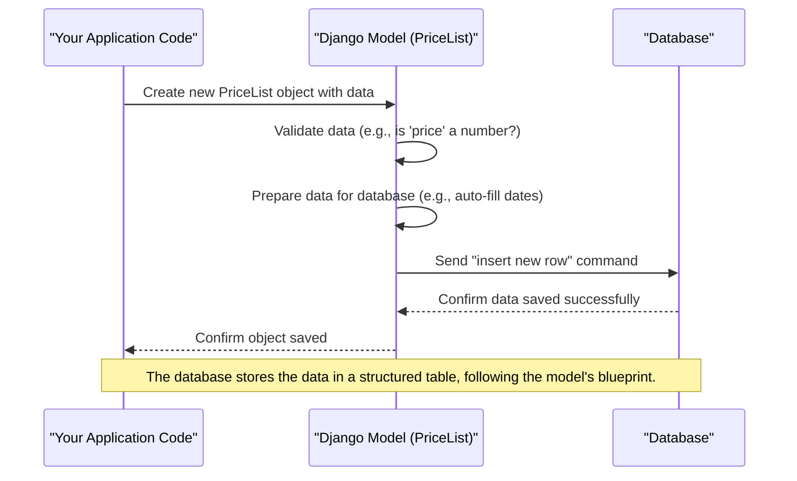

# Chapter 1: Data Models

Imagine you're building a system for a business that works with many different dealers. Each dealer might sell various items (like specific types of scrap metal), and they need to list their prices. You also need to keep track of important documents for each dealer (like their ID card or business license) and the specific areas (pincodes) where they offer their services.

How do you store all this information in an organized way so your computer program can easily find, update, and understand it? This is where **Data Models** come in!

## What are Data Models? (The Blueprint Analogy)

Think of a **Data Model** like a detailed blueprint for building something, like a house.

*   A house blueprint shows where the walls go, how many rooms there are, and what kind of doors and windows are needed.
*   In the same way, a **Data Model** is a blueprint for a specific type of information your application needs to store in its database. It tells your program exactly what kind of details each "item" will have and how different "items" are connected.

For our project, we have blueprints for things like:
*   **Price Lists**: To store details about an item's price and unit.
*   **Documents**: To store files like ID cards or business certificates.
*   **Pincodes**: To store the service areas for each dealer.

## Core Parts of a Data Model

Let's break down the main components of these blueprints.

### 1. Models (The Blueprint Itself)

In programming, each blueprint is defined as a "class" that inherits from `models.Model`. Each model represents a distinct "type" of data.

```python
# From dealer_details/models.py

from django.db import models

# This is a model! It's a blueprint for a "Price List" entry.
class PriceList(models.Model):
    # ... fields go here ...
```
This code snippet defines our `PriceList` model. It's the overall structure that holds information about a specific price for an item.

### 2. Fields (The Details on the Blueprint)

Inside each model, you define "fields." These are like the specific details on your house blueprint – for example, "number of bedrooms" or "type of roof."

For a `PriceList` model, fields would be things like `price` (how much?), `unit` (kg, pcs?), and `category_name` (what item?). Each field has a "type" (like text, number, date, or image) that tells the database what kind of information it expects.

Here are some examples of fields from our `PriceList` model:

```python
# From dealer_details/models.py (simplified example)
class PriceList(models.Model):
    category_name = models.CharField(max_length=250) # Text field for item name
    price = models.IntegerField()                     # Number field for price
    unit = models.CharField(max_length=3)             # Text field for unit (e.g., 'kg')
    created_date = models.DateTimeField(auto_now_add=True) # Date and time field
    # ... other fields ...
```
In this snippet:
*   `CharField` is used for text (like "Plastic Bottles" or "kg").
*   `IntegerField` is for whole numbers (like "250").
*   `DateTimeField` is for storing dates and times (like when the price was added).
These field types ensure that the data stored is always in the correct format.

### 3. Relationships (Connecting Blueprints)

Sometimes, one type of information needs to be linked to another. For example, a "Price List Entry" (our `PriceList` model) belongs to a specific "Dealer" (which is another blueprint called `DealerProfile`).

Data models allow us to define these connections using special fields called "relationships." The most common one is `ForeignKey`.

A `ForeignKey` field means "this piece of data is related to (or 'belongs to') an entry in another model."

Let's look at how our `PriceList` connects to a `DealerProfile`:

```python
# From dealer_details/models.py (simplified example)
# We need to import the DealerProfile model to link to it.
from accounts.models import DealerProfile

class PriceList(models.Model):
    # ... other fields ...
    dealer = models.ForeignKey(DealerProfile, on_delete=models.CASCADE)
    # This means each PriceList entry is linked to one specific DealerProfile.
```
Here, `dealer = models.ForeignKey(DealerProfile, ...)` tells our system that every `PriceList` entry must be associated with an existing `DealerProfile` (which is a blueprint for storing dealer details). `on_delete=models.CASCADE` is a rule that says if a `DealerProfile` is ever deleted, all its related `PriceList` entries should also be deleted automatically.

## Solving Our Use Case: Storing Price Lists

Let's say a dealer wants to add a new price for "Plastic Bottles" at "250 rupees per kg".
Using our `PriceList` model, we define the structure for this information.

**Here's the information we want to store:**
*   **Item**: Plastic Bottles
*   **Price**: 250
*   **Unit**: kg
*   **Dealer**: Dealer A (linked to their `DealerProfile`)
*   **Pincode**: 123456

**How the `PriceList` model helps:**
The `PriceList` model acts as a template. When you want to create a new price entry, you simply create a new "object" based on this blueprint and fill in the details for its fields.

```python
# Imagine this is happening in your program (very simplified)

# 1. We would first find the 'SubCategory' object for 'Plastic Bottles'
#    and the 'DealerProfile' object for 'Dealer A'.
#    (We're skipping the code for finding them for simplicity.)
# subcategory_object = ... # This holds details for Plastic Bottles
# dealer_object = ...      # This holds details for Dealer A

# 2. Now, we create a new PriceList entry:
# from dealer_details.models import PriceList # (This would be at the top of your file)

new_price_entry = PriceList(
    # Fields get their values from our desired input:
    subcategory_name='Plastic Bottles', # Text value
    price=250,                          # Number value
    unit='kg',                          # Text value
    dealer=dealer_object,               # Linked to the DealerProfile object
    pincode='123456'                    # Text value
    # Other fields (like category, GST) are often filled automatically
    # when you save, as defined in the model's 'save' method in models.py.
)

# 3. To save this entry into the database, you call the 'save()' method:
# new_price_entry.save()
```
After `new_price_entry.save()` is called, a new row is added to the `PriceList` table in your database, neatly storing all these details in their correct "columns" (fields).

## Under the Hood: How Data Models Work

When you create a model object and then use its `.save()` method to store data, here's a simple idea of what happens behind the scenes:



1.  **Your Application Code**: You write Python code to create a new `PriceList` object and assign values to its fields.
2.  **Django Model**: When you call `.save()`, the Django model acts like a smart assistant. It first checks if the data types are correct (e.g., `price` must be a number, `unit` must be text). It also prepares the data, automatically filling in things like `created_date`.
3.  **Database**: Finally, the Django model communicates with your database, telling it to add a new row of information according to the `PriceList` blueprint (table structure).

## Examples of Other Data Models in Our Project

Besides `PriceList`, our project uses other models to store different types of information, each with its own blueprint:

*   **`documents` Model**: This blueprint stores various files uploaded by a dealer, such as their Aadhar card, picture, or GST certificate. Notice how it uses `FileField` for documents.

    ```python
    # From dealer_details/models.py (simplified example)
    from django.db import models
    from django.core.validators import FileExtensionValidator

    class documents(models.Model):
        Aadhar_card = models.FileField( # Field for an Aadhar card file
            validators=[FileExtensionValidator(['png', 'jpg', 'jpeg', 'pdf'])],
            upload_to='documents/aadhar_card' # Folder where files are saved
        )
        Pic = models.ImageField(        # Field for a picture file
            validators=[FileExtensionValidator(['png', 'jpg', 'jpeg'])],
            upload_to='documents/Picture', null=True, blank=True
        )
        # ... other fields for different document types (e.g., GSTcertificate) ...
        status = models.CharField(max_length=12, default='INPROGRESS')
    ```
    The `documents` model uses `FileField` and `ImageField` to handle file uploads, specifying which file types are allowed. It also has a `status` field to track if a document is in progress, accepted, or canceled.

*   **`GetPincodes` Model**: This model stores the specific service areas (pincodes) a dealer operates in. You'll notice it has multiple `pincode` fields. This is an important model, and it will be the focus of our next chapter!

    ```python
    # From dealer_details/models.py (simplified example)
    from django.db import models
    from accounts.models import DealerProfile # To link to the dealer

    class GetPincodes(models.Model):
        dealer_id = models.ForeignKey(DealerProfile, on_delete=models.CASCADE)
        pincode1 = models.CharField(max_length=6, null=True, blank=True)
        pincode2 = models.CharField(max_length=6, null=True, blank=True)
        # ... up to pincode11 ...
        no_of_pincodes = models.IntegerField(default=5, null=True, blank=True)
    ```
    Just like `PriceList`, `GetPincodes` also uses a `ForeignKey` to link to a `DealerProfile`, ensuring we know exactly which dealer serves which pincodes.

## Conclusion

In this chapter, we learned that Data Models are like blueprints that define the structure of the information our application needs to store. We saw how models use "fields" to describe individual pieces of data and "relationships" (like `ForeignKey`) to connect different types of information. This structured approach helps our application keep track of everything from product prices to dealer documents in an organized and efficient way within a database.

Now that we understand how data is structured, let's dive into a specific example: how we manage the pincodes (service areas) for dealers using the `GetPincodes` model.

[Next Chapter: Dealer Pincode Management](02_dealer_pincode_management_.md)

---

<sub><sup>Generated by [AI Codebase Knowledge Builder](https://github.com/The-Pocket/Tutorial-Codebase-Knowledge).</sup></sub> <sub><sup>**References**: [[1]](https://github.com/snehabansal483/document_dealer_details/blob/3a6a056be89f90b25576832be3c4f2c44f3ea086/dealer_details/models.py)</sup></sub>