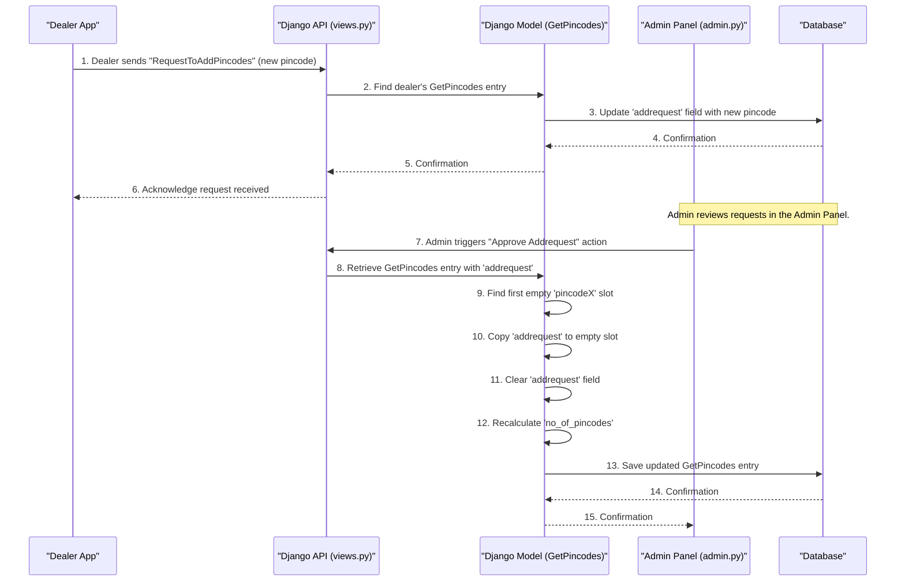

# Chapter 2: Dealer Pincode Management

In the [previous chapter](01_data_models_.md), we learned about **Data Models**, which are like blueprints for storing different kinds of information in our system. We saw models for price lists and documents. At the end, we briefly touched upon a model called `GetPincodes`.

This chapter is all about how we use that `GetPincodes` model to handle a very important aspect of our business: managing the specific service areas (called **pincodes**) where each dealer operates.

## The Problem: Knowing Where Dealers Work

Imagine you have many dealers, and each one covers specific areas defined by pincodes.
*   Dealer A covers pincode 123456 and 789012.
*   Dealer B covers pincode 987654.

How do we keep track of this information? What if a dealer wants to add a *new* pincode to their service area? Or remove one? Or update their whole list of service areas? Our system needs a smart way to manage these geographical boundaries.

This is where **Dealer Pincode Management** comes in!

**Our Central Use Case:** A dealer wants to expand their service to a new area and requests to add a new pincode. Our system needs to allow them to make this request, and then an administrator needs to approve it, adding the pincode to the dealer's approved list.

## The `GetPincodes` Model: Our Pincode Blueprint

Just like we have a blueprint for `PriceList` or `documents`, we have a special blueprint for dealer pincodes: the `GetPincodes` model.

Let's look at its core structure:

```python
# From dealer_details/models.py (simplified)
from django.db import models
from accounts.models import DealerProfile # To link to the dealer

class GetPincodes(models.Model):
    dealer_id = models.ForeignKey(DealerProfile, on_delete=models.CASCADE)
    pincode1 = models.CharField(max_length=6, null=True, blank=True)
    pincode2 = models.CharField(max_length=6, null=True, blank=True)
    # ... up to pincode11 ...
    addrequest = models.CharField(max_length=6, null=True, blank=True)
    no_of_pincodes = models.IntegerField(default=5, null=True, blank=True)
    # ... other fields for tracking dates ...
```

Think of this model as having:
*   **`dealer_id`**: This is a [relationship](01_data_models_.md) (`ForeignKey`) that links this pincode information to a specific `DealerProfile` (our dealer blueprint). It tells us *which* dealer this pincode entry belongs to.
*   **`pincode1` through `pincode11`**: These are like individual "slots" or "boxes" where we can store up to 11 different pincodes for a dealer. Why multiple fixed slots? This design choice provides a clear, structured way to store a set number of pincodes directly in the database.
*   **`addrequest`**: This is a special temporary "mailbox" field. When a dealer wants to add a *new* pincode, they send it to this mailbox. It waits here until an administrator reviews and approves it.
*   **`no_of_pincodes`**: This field simply keeps count of how many of the `pincode1` to `pincode11` slots are currently filled for a dealer. It's a quick way to know the total number of active pincodes without checking each slot individually.

## Solving Our Use Case: Requesting and Approving a Pincode

Let's walk through our use case: A dealer wants to add pincode `345678` to their service area.

### Step 1: Dealer Requests a New Pincode

When a dealer wants to add a new pincode, they can use an API (Application Programming Interface) call. Think of an API as a special button or form on a website that sends a message to our system.

The dealer will send their `dealer_id` and the `addrequest` (the new pincode).

```python
# Simplified example of what happens when a dealer requests a pincode
# This is handled by the RequesttoAddPincodes view in views.py

# Imagine a dealer with ID 123 wants to add pincode "345678"
dealer_id_to_update = 123
new_pincode_request = "345678"

# Our system finds the GetPincodes entry for this dealer
# and puts the new pincode into the 'addrequest' mailbox.
# This doesn't immediately add it to pincode1, pincode2, etc.
# It just holds the request.
# Example:
# pins_entry = GetPincodes.objects.get(dealer_id=dealer_id_to_update)
# pins_entry.addrequest = new_pincode_request
# pins_entry.save()
```
After this, the `addrequest` field for that dealer's `GetPincodes` entry will contain "345678".

### Step 2: Administrator Approves the Request

Now, the `addrequest` field is like a flag for the administrator. An administrator needs to go into the system's backend (the admin interface) and approve this request.

When the administrator approves it, our system automatically finds an *empty* pincode slot (`pincode1` through `pincode11`), moves the value from `addrequest` into that empty slot, clears the `addrequest` mailbox, and updates the `no_of_pincodes` count.

Let's see an example of a `GetPincodes` entry **before** and **after** approval:

| Field           | Before Approval (Dealer ID 123) | After Approval (Dealer ID 123) |
| :-------------- | :------------------------------ | :----------------------------- |
| `dealer_id`     | `123`                           | `123`                          |
| `pincode1`      | `100001`                        | `100001`                       |
| `pincode2`      | `200002`                        | `200002`                       |
| `pincode3`      | `None`                          | `345678`                       |
| `pincode4`      | `None`                          | `None`                         |
| ...             | ...                             | ...                            |
| `addrequest`    | `345678`                        | `None`                         |
| `no_of_pincodes` | `2`                             | `3`                            |

Notice how `pincode3` went from `None` (empty) to `345678`, `addrequest` was cleared, and `no_of_pincodes` increased!

## Under the Hood: How Pincode Management Works

Let's peek behind the scenes to see how our system handles these requests and approvals.

### The Journey of a Pincode Request and Approval



1.  **Dealer Sends Request**: The dealer uses their application (or an API call) to send their `dealer_id` and the new pincode they want to add.
2.  **API Receives Request**: A special part of our Django application, called an API "view" (specifically `RequestToAddPincodes` in `views.py`), receives this request.
3.  **Model Updates `addrequest`**: The view finds the correct `GetPincodes` entry for that dealer in the database and updates its `addrequest` field with the new pincode. It doesn't put it into `pincode1`, `pincode2`, etc., yet.
4.  **Admin Reviews**: An administrator logs into the Django Admin Panel (a special interface to manage data). They see the `GetPincodes` entries and notice the ones with `addrequest` values.
5.  **Admin Approves**: The administrator selects the entry and uses a special "action" (called `approve_addrequest` in `admin.py`).
6.  **Action Logic**: This action's code runs. It looks at the selected `GetPincodes` entry. It goes through `pincode1`, `pincode2`, etc., trying to find the *first empty slot*.
7.  **Fill Slot & Clear Request**: Once an empty slot is found, the value from `addrequest` is moved into that slot. The `addrequest` field is then cleared (set back to `None`).
8.  **Update Count**: The `no_of_pincodes` field is recalculated by counting how many `pincode` slots are now filled.
9.  **Save to Database**: Finally, the updated `GetPincodes` entry is saved back to the database. The new pincode is now officially part of the dealer's service area!

### Code Snippets Explained

Let's look at the actual code that makes this happen:

#### 1. The `GetPincodes` Model (Blueprint) Revisited

```python
# From dealer_details/models.py
class GetPincodes(models.Model):
    dealer_id = models.ForeignKey(DealerProfile, on_delete=models.CASCADE)
    pincode1 = models.CharField(max_length=6, null=True, blank=True)
    pincode2 = models.CharField(max_length=6, null=True, blank=True)
    pincode3 = models.CharField(max_length=6, null=True, blank=True)
    pincode4 = models.CharField(max_length=6, null=True, blank=True)
    pincode5 = models.CharField(max_length=6, null=True, blank=True)
    pincode6 = models.CharField(max_length=6, null=True, blank=True)
    pincode7 = models.CharField(max_length=6, null=True, blank=True)
    pincode8 = models.CharField(max_length=6, null=True, blank=True)
    pincode9 = models.CharField(max_length=6, null=True, blank=True)
    pincode10 = models.CharField(max_length=6, null=True, blank=True)
    pincode11 = models.CharField(max_length=6, null=True, blank=True)
    addrequest = models.CharField(max_length=6, null=True, blank=True)
    no_of_pincodes = models.IntegerField(default=5, null=True, blank=True)
    # ... created_at and updated_at fields ...
```
This is the blueprint we discussed. It clearly defines the fixed 11 slots for pincodes, the `addrequest` field for pending requests, and `no_of_pincodes` to track the count. `null=True, blank=True` means these fields can be empty in the database.

#### 2. Dealer Requesting Pincode (API View)

```python
# From dealer_details/views.py (simplified)
class RequestToAddPincodes(APIView):
    serializer_class = RequesttoAddPincodesSerializer # Helper for data formatting

    def post(self, request):
        dealer_id = request.data['dealer_id']
        addrequest = request.data['addrequest'] # The new pincode from the dealer

        # Find the dealer's pincode entry in the database
        pins = GetPincodes.objects.get(dealer_id=dealer_id)

        if pins.addrequest is None: # Is the 'mailbox' empty?
            pins.addrequest = addrequest # Put the new pincode in the mailbox
            pins.save() # Save the change to the database
            return Response({'success': 'Request submitted!'})
        else:
            return Response({'Not Acceptable': 'Request pending, please wait.'})
```
This code shows how `RequestToAddPincodes` handles a request. It checks if there's already a pending request in the `addrequest` field. If not, it places the new pincode there and saves it. This is how the dealer's request is recorded.

#### 3. Administrator Approval (Admin Action)

This is the most crucial part of the approval process. It lives in `dealer_details/admin.py` and is a special function that the administrator can run from the Django admin interface.

```python
# From dealer_details/admin.py (simplified)
from django.contrib import messages
from django.contrib import admin
from dealer_details.models import GetPincodes # Import our model

@admin.action(description='Approve Addrequest and Add Pincode(s)')
def approve_addrequest(modeladmin, request, queryset):
    for obj in queryset: # Loop through each selected GetPincodes entry
        if obj.addrequest: # Is there a pending request in the 'mailbox'?
            new_pins = obj.addrequest.split(',') # In case multiple were requested
            new_pins = [pin.strip() for pin in new_pins if pin.strip().isdigit()]

            # List of all our pincode slots
            pincode_fields = ['pincode1', 'pincode2', 'pincode3', 'pincode4',
                              'pincode5', 'pincode6', 'pincode7', 'pincode8',
                              'pincode9', 'pincode10', 'pincode11']

            index = 0
            for i in range(len(current_pins)):
                # Find the first empty slot and fill it
                if getattr(obj, pincode_fields[i]) in [None, ''] and index < len(new_pins):
                    setattr(obj, pincode_fields[i], new_pins[index])
                    index += 1

            obj.addrequest = None # Clear the 'mailbox' after processing
            
            # Recalculate the total number of pincodes
            obj.no_of_pincodes = sum(1 for field in pincode_fields if getattr(obj, field))
            obj.save() # Save all changes to the database
            messages.success(request, f"{obj.dealer_id}: Pincode(s) added.")
        else:
            messages.warning(request, f"{obj.dealer_id}: No addrequest to process.")

# Register the model with the admin panel and add our custom action
class GetPincodesAdmin(admin.ModelAdmin):
    list_display = ('id', 'dealer_id', 'addrequest', 'pincode1', 'no_of_pincodes') # Show these fields
    actions = [approve_addrequest] # Make our action available

admin.site.register(GetPincodes, GetPincodesAdmin)
```
This powerful code snippet is the core of the approval process.
*   `@admin.action`: This decorator turns `approve_addrequest` into a callable action from the admin panel.
*   `for obj in queryset`: Allows the admin to select and process multiple `GetPincodes` entries at once.
*   `pincode_fields`: This list contains the names of all our pincode slots.
*   `getattr(obj, field)` and `setattr(obj, field, value)`: These are Python functions that let us get or set the value of a field on an object using its name (like `obj.pincode1` is the same as `getattr(obj, 'pincode1')`).
*   The `for` loop checks each `pincodeX` field. If it's empty, it fills it with the new pincode from `addrequest`.
*   `obj.addrequest = None`: Clears the request.
*   `obj.no_of_pincodes = sum(...)`: Recalculates the count by checking how many `pincodeX` fields are *not* empty.
*   `obj.save()`: Saves all these changes back to the database.

#### 4. Updating All Pincodes (Full Update)

Sometimes, a dealer might want to completely change their set of pincodes, not just add one.
```python
# From dealer_details/views.py (simplified)
class UpdatePincodes(APIView):
    serializer_class = UpdatePincodesSerializer

    def post(self, request):
        dealer_id = request.data.get('dealer_id')
        
        # Get pincode values from the request, they could be None if not provided
        p1 = request.data.get('pincode1')
        p2 = request.data.get('pincode2')
        # ... up to pincode11 ...

        pins = GetPincodes.objects.get(dealer_id=dealer_id)
        
        # Directly update each pincode slot with the new values
        pins.pincode1 = p1
        pins.pincode2 = p2
        # ... and so on for all 11 pincodes ...

        pins.save() # Save changes
        return Response({'success': 'Pincodes updated successfully!'})
```
This view allows a dealer (or an admin) to send a full list of pincodes, and the system will simply overwrite the existing `pincode1` through `pincode11` slots with the new values. This offers flexibility for full updates.

#### 5. Tracking the Number of Pincodes (Count)

```python
# From dealer_details/views.py (simplified)
class No_of_pincodes(APIView):
    def get(self, request, dealer_id):
        pins = GetPincodes.objects.get(dealer_id=dealer_id)
        
        # Manually count filled pincode slots
        pin_nos = 0
        if pins.pincode1: pin_nos += 1
        if pins.pincode2: pin_nos += 1
        # ... check all 11 pincodes ...

        pins.no_of_pincodes = pin_nos # Update the count field
        pins.save() # Save the updated count
        return Response({'total_pincodes': pin_nos})
```
This view calculates the total number of non-empty pincode slots for a dealer and updates the `no_of_pincodes` field in the database. While the `approve_addrequest` action also updates this, this specific view ensures the count is always accurate, even if pincodes are changed directly (e.g., via `UpdatePincodes`).

## Conclusion

In this chapter, we explored how our system manages dealer pincodes using the `GetPincodes` model. We learned about its various fields, including the fixed pincode slots, the `addrequest` "mailbox" for new requests, and the `no_of_pincodes` counter. We saw how a dealer can request a new pincode and how an administrator can approve it, automatically filling an available slot. This system ensures dealers operate within defined regions and provides a clear process for expanding their service areas.

Now that we understand how data is structured and how pincodes are managed, the next step is to understand how this data is prepared for sending over the internet and for displaying in various applications.

[Next Chapter: Data Serialization](03_data_serialization_.md)

---

<sub><sup>Generated by [AI Codebase Knowledge Builder](https://github.com/The-Pocket/Tutorial-Codebase-Knowledge).</sup></sub> <sub><sup>**References**: [[1]](https://github.com/snehabansal483/document_dealer_details/blob/3a6a056be89f90b25576832be3c4f2c44f3ea086/dealer_details/admin.py), [[2]](https://github.com/snehabansal483/document_dealer_details/blob/3a6a056be89f90b25576832be3c4f2c44f3ea086/dealer_details/models.py), [[3]](https://github.com/snehabansal483/document_dealer_details/blob/3a6a056be89f90b25576832be3c4f2c44f3ea086/dealer_details/serializers.py), [[4]](https://github.com/snehabansal483/document_dealer_details/blob/3a6a056be89f90b25576832be3c4f2c44f3ea086/dealer_details/views.py)</sup></sub>