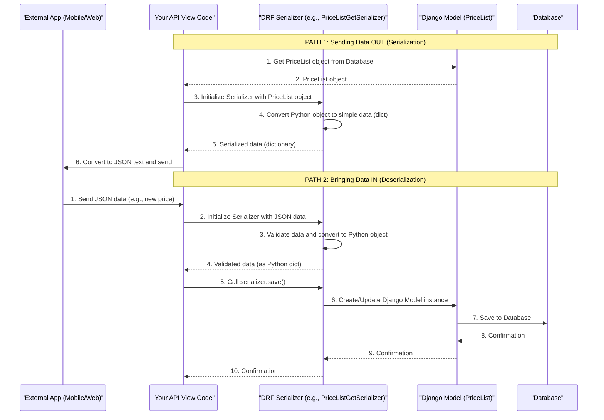

# Chapter 3: Data Serialization

In the [previous chapter](02_dealer_pincode_management_.md), we learned how our system uses **Data Models** (like `GetPincodes`) to store and manage important information, such as which pincodes a dealer covers. We saw how this data lives neatly organized within our Django application and its database.

But what happens when this carefully organized data needs to leave our application? Or when data from the outside world (like a mobile app) needs to come *into* our application?

Imagine you're building a mobile app for dealers. This app needs to:
1.  **Display a dealer's current price list.**
2.  **Allow a dealer to add a new price for an item.**

Our Django models (like `PriceList` or `GetPincodes`) are complex Python "objects." They understand things like `ForeignKey` relationships and specific field types (e.g., `CharField`, `IntegerField`). However, a mobile app or a web browser doesn't understand these complex Python objects directly. They usually expect data in a simple, universally understood format, like **JSON** (JavaScript Object Notation), which looks like plain text with `{}` and `[]`.

This is where **Data Serialization** comes to the rescue!

## What is Data Serialization? (The Universal Translator Analogy)

Think of **Data Serialization** as having a **universal translator** for your application's data, or like **packing and unpacking a suitcase for travel.**

*   **Serialization (Packing)**: This is the process of taking complex data (like our Django `PriceList` Python objects) and converting them into a simple, standardized format (like a JSON string) that can be easily sent over the internet. It's like packing your clothes neatly into a suitcase so they can travel safely.

    *   **From:** `PriceList` object (Python)
    *   **To:** JSON string (Plain text)

*   **Deserialization (Unpacking)**: This is the reverse process. When data comes into our application (e.g., a new price entered by a user from a mobile app, sent as a JSON string), deserializers translate it back into complex Django model objects. They also make sure the data is valid and fits the expected structure *before* it's saved to our database. It's like unpacking your suitcase and putting your clothes back in your wardrobe.

    *   **From:** JSON string (Plain text)
    *   **To:** `PriceList` object (Python)

In short:
*   **Serialization** is for **sending data OUT** of your Django application.
*   **Deserialization** is for **bringing data IN** to your Django application.

## How Django REST Framework (DRF) Helps with Serialization

Our project uses a powerful tool called **Django REST Framework (DRF)**. DRF provides special classes called **Serializers** that handle all this packing and unpacking automatically for us. They bridge the gap between our complex Django models and simple data formats like JSON.

## Solving Our Use Case: Displaying a Price List

Let's use our first problem: **displaying a dealer's current price list in a mobile app.**

We have `PriceList` objects in our database. We need to convert them into JSON to send to the mobile app.

We use a Serializer for this, specifically `PriceListGetSerializer` from `dealer_details/serializers.py`.

```python
# From dealer_details/serializers.py (simplified)
from rest_framework import serializers
from .models import PriceList # Our PriceList blueprint

class PriceListGetSerializer(serializers.ModelSerializer):
    class Meta:
        model = PriceList # Tell the serializer which model to use
        fields = '__all__' # Include ALL fields from the PriceList model
```

**Explanation:**
*   `serializers.ModelSerializer`: This is a special type of serializer that knows how to automatically map fields from a Django model. It's a huge time-saver!
*   `class Meta`: This nested class is where we tell the serializer important details.
    *   `model = PriceList`: We specify that this serializer is built for our `PriceList` model.
    *   `fields = '__all__'`: This tells the serializer to include every field that exists in the `PriceList` model when converting it to JSON.

**Example: Serialization in Action (Outputting Data)**

Imagine we have a `PriceList` object in Django like this (conceptual, not actual Python code here):

```
PriceList Object:
  id: 1
  subcategory: "Plastic Bottles"
  dealer: <DealerProfile object for Dealer A>
  pincode: "123456"
  price: 250
  unit: "kg"
  created_date: "2023-10-27T10:00:00Z"
```

When we pass this `PriceList` object through `PriceListGetSerializer`, it gets converted into a JSON string:

```json
{
    "id": 1,
    "subcategory": "Plastic Bottles",
    "dealer": 123,  // Often just the ID of the linked object
    "pincode": "123456",
    "price": 250,
    "unit": "kg",
    "created_date": "2023-10-27T10:00:00Z"
}
```
This JSON is plain text that any mobile app or web browser can easily understand and display!

## Solving Our Use Case: Adding a New Price Entry

Now for the second problem: **allowing a dealer to add a new price for an item from a mobile app.**

The mobile app will send data (e.g., item name, price, pincode) as a JSON string. We need to convert this JSON back into a `PriceList` Python object, validate it, and then save it to our database. This is **deserialization**.

We use another serializer for this, `PriceListPostSerializer`.

```python
# From dealer_details/serializers.py (simplified)
from rest_framework import serializers
from .models import PriceList # Our PriceList blueprint

class PriceListPostSerializer(serializers.ModelSerializer):
    class Meta:
        model = PriceList
        fields = ('subcategory', 'dealer', 'pincode', 'price') # Only these fields for input
```

**Explanation:**
Notice that `fields` here is a specific list `('subcategory', 'dealer', 'pincode', 'price')`. This is because when creating a *new* item, we only need these essential pieces of information from the user. Other fields, like `id` or `created_date`, are usually generated automatically by Django or the database.

**Example: Deserialization in Action (Inputting Data)**

Imagine a mobile app sends this JSON to our Django application:

```json
{
    "subcategory": "Scrap Metal",
    "dealer": 456, // The ID of the dealer
    "pincode": "998877",
    "price": 150
}
```

Here's how our Django application uses `PriceListPostSerializer` to process this:

```python
# Imagine this code is in an API "view" (Chapter 4 will cover these!)
# from dealer_details.serializers import PriceListPostSerializer

# 1. Get the raw JSON data from the incoming request
# request_data = {
#     "subcategory": "Scrap Metal",
#     "dealer": 456,
#     "pincode": "998877",
#     "price": 150
# }

# 2. Create a serializer instance with the incoming data
serializer = PriceListPostSerializer(data=request_data)

# 3. Validate the data (e.g., is 'price' a number? Is 'dealer' a valid ID?)
if serializer.is_valid():
    # 4. If valid, convert to a PriceList object and save to database
    new_price_entry = serializer.save()
    # new_price_entry is now a PriceList object saved in the database!
    # ... return success message ...
else:
    # ... return error messages based on validation failures ...
    pass
```

**What happens here:**
1.  We give the incoming `request_data` (our JSON) to `PriceListPostSerializer`.
2.  `serializer.is_valid()`: This is crucial! The serializer automatically checks if all the data types are correct (e.g., `price` is a number, `pincode` is text) and if all required fields are present. If anything is wrong, it won't be valid and will provide error messages.
3.  `serializer.save()`: If the data passes all validation checks, this method creates a *new* `PriceList` object in memory and then saves it as a new row in our database.

This entire process ensures that only correct and properly structured data makes it into our database.

## Under the Hood: The Serialization Journey

Let's visualize the journey of data through a serializer.



### Path 1: Sending Data Out (Serialization)
1.  **Your API View Code** asks the **Django Model** to fetch some data (e.g., a `PriceList` object) from the **Database**.
2.  The `PriceList` **Django Model** (a Python object) is returned to **Your API View Code**.
3.  **Your API View Code** passes this `PriceList` object to a **DRF Serializer** (like `PriceListGetSerializer`).
4.  The **DRF Serializer** takes the complex Python object and converts it into a simpler Python dictionary.
5.  The **DRF Serializer** returns this simple dictionary to **Your API View Code**.
6.  **Your API View Code** then takes this dictionary, converts it into a JSON text string, and sends it to the **External App**.

### Path 2: Bringing Data In (Deserialization)
1.  An **External App** sends JSON data (e.g., for a new price) to **Your API View Code**.
2.  **Your API View Code** initializes a **DRF Serializer** (like `PriceListPostSerializer`) with this incoming JSON data.
3.  The **DRF Serializer** validates the incoming data (checks types, required fields, etc.) and, if valid, converts it into a Python object (but not yet a full Django model instance).
4.  The **DRF Serializer** signals to **Your API View Code** that the data is valid.
5.  **Your API View Code** then calls `serializer.save()`.
6.  The **DRF Serializer** uses the validated data to create or update a **Django Model** instance.
7.  The **Django Model** then saves this new or updated data to the **Database**.
8.  The **Database** confirms the save.
9.  The **Django Model** confirms to the **DRF Serializer**.
10. The **DRF Serializer** confirms to **Your API View Code** that the operation was successful.

## Other Serializers in Our Project

Just like `PriceListGetSerializer` and `PriceListPostSerializer`, our project uses many other serializers in `dealer_details/serializers.py` for different data models and purposes:

*   **`DocumentsSerializer` / `GetDocumentsSerializer`**: Used for sending and receiving dealer document details. Since documents involve file uploads, these serializers handle that complexity.
*   **`AddPincodesSerializer`**: Used for specifying which pincodes a dealer covers.
*   **`RequesttoAddPincodesSerializer`**: Specifically handles the `addrequest` field we saw in the [Dealer Pincode Management chapter](02_dealer_pincode_management_.md), allowing a dealer to request a new pincode.
*   **`GetallPincodesSerializer`**: Used to send *all* pincode details for a dealer (including `pincode1` through `pincode11` and `addrequest`).
*   **`UpdatePincodesSerializer`**: Used when a dealer (or admin) wants to update their full list of pincodes directly.

Each of these serializers serves as a dedicated translator for a specific piece of information, ensuring that data is correctly packed and unpacked for its journey between our Django application and other systems.

## Conclusion

In this chapter, we unpacked the concept of **Data Serialization**. We learned that it's the crucial process of converting complex Django model objects into simple, universal formats (like JSON) for sending data out, and converting those simple formats back into Django objects for bringing data in. Django REST Framework's **Serializers** act as our universal translators, handling this packing, unpacking, and validation efficiently.

Now that we understand how data is prepared for travel, the next logical step is to see how this data actually travels – through **API Endpoints**, which are like the specific addresses or routes that data takes.

[Next Chapter: API Endpoints (Views & URLs)](04_api_endpoints__views___urls__.md)

---

<sub><sup>Generated by [AI Codebase Knowledge Builder](https://github.com/The-Pocket/Tutorial-Codebase-Knowledge).</sup></sub> <sub><sup>**References**: [[1]](https://github.com/snehabansal483/document_dealer_details/blob/3a6a056be89f90b25576832be3c4f2c44f3ea086/dealer_details/serializers.py)</sup></sub>