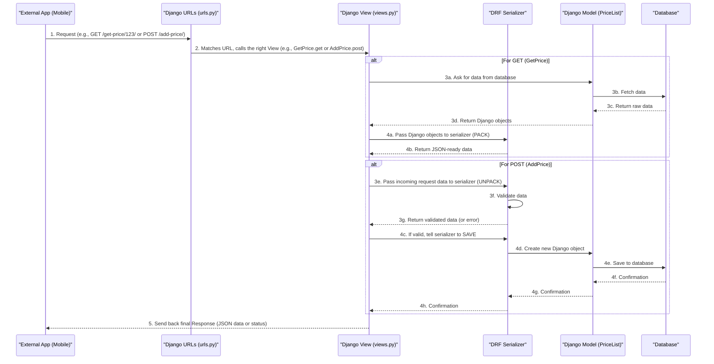

# Chapter 4: API Endpoints (Views & URLs)

In the [previous chapter](03_data_serialization_.md), we learned about **Data Serialization**, which is like packing and unpacking our application's data (such as a dealer's price list or document details) so it can travel easily over the internet in formats like JSON.

But once our data is "packed" (serialized) and ready, how does it actually get sent to a mobile app or another service? And how does our application *receive* new data from them? This is where **API Endpoints** come into play!

## The Problem: How Do Programs Talk to Each Other?

Imagine our Django application is a restaurant kitchen. We have our ingredients (data models like `PriceList`), and we know how to prepare dishes (serialization). But how do customers (other programs like mobile apps) order food or pick it up? They need a menu and a service window!

If a mobile app wants to:
1.  **Get a list of prices** for a specific dealer.
2.  **Add a new price** for an item.

How does it tell our Django application what it wants to do and where to send the information?

This is precisely what **API Endpoints** solve! They provide the "menu" and "service windows" for your application.

## What are API Endpoints? (The Restaurant Analogy)

Think of API Endpoints as a **menu of services** your application offers to other programs.

*   **URLs (The Addresses)**: These are like the **unique addresses** for each service on your menu. For example, `/add-price/` is where you go to add a new price, and `/get-documents/` is where you get documents. They tell the system *where* to find a specific service.
*   **Views (The Workers)**: These are the **actual workers** (or chefs in our kitchen) behind these addresses. When a request arrives at a URL, the corresponding view performs the necessary actions. For example, the "Add Price" view might take the new price data, save it to the database, and then tell you if it was successful.

In short: A **URL** is the path you type, and a **View** is the code that runs when you visit that path. Together, they form an **API Endpoint**.

## Solving Our Use Case: Getting and Adding Prices

Let's use our problem: a mobile app wants to **get** a dealer's price list and **add** a new price entry.

### 1. URLs: Setting Up the Addresses (`dealer_details/urls.py`)

First, we need to define the "addresses" or "paths" that other applications can use. These are set up in a file named `urls.py` inside our `dealer_details` application.

```python
# From dealer_details/urls.py (simplified)
from django.urls import path
from .views import * # Import all our "workers" (views)

urlpatterns = [
    # Address to add a new price
    path('add-price/', AddPrice.as_view(), name='add-price'),

    # Address to get prices for a specific dealer
    # <dealer_id> means this part of the address will change (e.g., /get-price/123/)
    path('get-price/<dealer_id>/', GetPrice.as_view(), name='get-price'),
]
```

**Explanation:**
*   `path('add-price/', ...)`: This means if someone visits `/add-price/` on our server, a specific action should happen.
*   `AddPrice.as_view()`: This tells Django which "worker" (or **View**) to call when the `/add-price/` address is accessed. We'll look at `AddPrice` next!
*   `<dealer_id>`: This is a placeholder. It means that the `dealer_id` part of the URL (e.g., `123` in `/get-price/123/`) will be captured and sent to the `GetPrice` view so it knows *which* dealer's prices to fetch.
*   `name='add-price'`: This gives a convenient name to our URL pattern, which is useful within our Django project.

### 2. Views: The Workers Behind the Addresses (`dealer_details/views.py`)

Now, let's look at the "workers" that actually do the job when a URL is accessed. These are defined in `views.py`.

#### A. `GetPrice` View (To get a dealer's prices)

This worker handles requests to the `/get-price/<dealer_id>/` address. It's designed to *receive* a request (usually a `GET` request, like asking for information) and *send back* the price list.

```python
# From dealer_details/views.py (simplified)
from rest_framework.views import APIView # Our powerful base for views
from rest_framework.response import Response # To send back replies
from .serializers import PriceListGetSerializer # Our data "packer"
from .models import PriceList # Our PriceList "blueprint"

class GetPrice(APIView):
    def get(self, request, dealer_id): # This method runs for GET requests
        # 1. Find the prices for this specific dealer in the database
        prices = PriceList.objects.filter(dealer_id=dealer_id)

        # 2. Use our serializer (from Chapter 3) to "pack" the data
        #    'many=True' because we expect multiple price entries
        serializer = PriceListGetSerializer(prices, many=True)

        # 3. Send back the "packed" data as a response
        return Response(serializer.data)
```

**Explanation:**
*   `class GetPrice(APIView):`: `APIView` is a special class from Django REST Framework that makes it easy to build API workers.
*   `def get(self, request, dealer_id):`: This method will be called when a `GET` request (like browsing a website or asking for data) comes to the `/get-price/<dealer_id>/` URL.
    *   `request`: Contains all the details about the incoming request.
    *   `dealer_id`: This is the value captured from the URL (e.g., `123`).
*   `PriceList.objects.filter(...)`: This is how we talk to our [Data Models](01_data_models_.md) to get specific information from the database.
*   `PriceListGetSerializer(...)`: We use our "packer" from [Data Serialization](03_data_serialization_.md) to turn the complex Django objects into simple data (JSON).
*   `return Response(serializer.data)`: This sends the JSON data back to the mobile app or wherever the request came from.

**Example Request & Response:**

*   **Request (from mobile app):** `GET /get-price/123/` (Mobile app wants prices for dealer ID 123)
*   **Response (from our API):**
    ```json
    [
        {
            "id": 1,
            "subcategory": "Plastic Bottles",
            "dealer": 123,
            "pincode": "123456",
            "price": 250,
            "unit": "kg"
        },
        {
            "id": 2,
            "subcategory": "Cardboard",
            "dealer": 123,
            "pincode": "123456",
            "price": 100,
            "unit": "kg"
        }
    ]
    ```
    The mobile app receives this JSON and can easily display it.

#### B. `AddPrice` View (To add a new price entry)

This worker handles requests to the `/add-price/` address. It's designed to *receive* data (usually a `POST` request, like submitting a form) and *save* it.

```python
# From dealer_details/views.py (simplified)
from rest_framework.views import APIView
from rest_framework.response import Response
from rest_framework import status # For HTTP status codes (like success/error)
from .serializers import PriceListPostSerializer # Our data "unpacker"

class AddPrice(APIView):
    serializer_class = PriceListPostSerializer # Tell the view which serializer to use
    
    def post(self, request): # This method runs for POST requests
        # 1. Take the incoming data and pass it to our serializer ("unpacker")
        serializer = PriceListPostSerializer(data=request.data)

        # 2. Check if the data is valid (e.g., correct types, required fields)
        if serializer.is_valid(raise_exception=True): # If not valid, it automatically sends an error
            # 3. If valid, "unpack" the data and save it as a new PriceList entry
            serializer.save() 
            
            # 4. Send back a success message or the saved data
            return Response(serializer.data, status=status.HTTP_201_CREATED) # 201 means "Created"
```

**Explanation:**
*   `def post(self, request):`: This method will be called when a `POST` request (like submitting a form with new data) comes to the `/add-price/` URL.
*   `serializer = PriceListPostSerializer(data=request.data)`: We give the incoming data (`request.data`) to our "unpacker" from [Data Serialization](03_data_serialization_.md).
*   `serializer.is_valid(raise_exception=True)`: This is where the serializer validates the data. If the data is missing something or has the wrong format, it will automatically send an error response.
*   `serializer.save()`: If the data is valid, this crucial line takes the validated data and saves it as a new `PriceList` object in our database.
*   `return Response(serializer.data, status=status.HTTP_201_CREATED)`: We send back the newly saved data and an HTTP status code `201 Created` to confirm success.

**Example Request & Response:**

*   **Request (from mobile app):** `POST /add-price/` (Mobile app wants to add a new price)
    *   **Body (JSON data being sent):**
        ```json
        {
            "subcategory": "New Item Type",
            "dealer": 456,
            "pincode": "998877",
            "price": 500
        }
        ```
*   **Response (from our API):**
    ```json
    {
        "id": 3,
        "subcategory": "New Item Type",
        "dealer": 456,
        "pincode": "998877",
        "price": 500,
        "unit": "pcs", // Unit might be auto-filled by the model
        "created_date": "2023-10-27T11:30:00Z"
    }
    ```
    And now, a new entry for "New Item Type" is saved in our database!

## Under the Hood: The Journey Through an API Endpoint

Let's visualize the entire process from an external application's request to our database and back.



1.  **External App Makes Request**: A mobile app or another service sends a request (like `GET` for information or `POST` to send new data) to a specific URL on our server.
2.  **Django URLs Match**: Our `urls.py` file acts like a router. It looks at the incoming URL and figures out which `View` (worker) is responsible for handling it.
3.  **Django View Processes Request**:
    *   **For `GET` requests (like `GetPrice`):** The View asks the [Django Model](01_data_models_.md) to get data from the database. Once it has the data (as Python objects), it gives them to a [DRF Serializer](03_data_serialization_.md) to "pack" them into a simple, JSON-ready format.
    *   **For `POST` requests (like `AddPrice`):** The View takes the incoming data from the request and gives it to a [DRF Serializer](03_data_serialization_.md) to "unpack" and validate it. If the data is valid, the serializer saves it as a new entry in our database.
4.  **Response Sent Back**: Finally, the `View` sends a `Response` back to the external application, containing the requested data (for `GET`) or a confirmation message (for `POST`).

## Other API Endpoints in Our Project

Our project has many more API Endpoints defined in `dealer_details/urls.py` and implemented in `dealer_details/views.py`, each serving a specific purpose:

*   **`add_documents/` and `get_documents/<dealer_id>/`**: For handling dealer document uploads and retrievals.
*   **`add_pincodes/` and `update_pincodes/`**: For initial setup and full updates of a dealer's service pincodes.
*   **`request_to_add_pincodes/`**: As seen in [Dealer Pincode Management](02_dealer_pincode_management_.md), this is the endpoint where dealers submit a request to add a new pincode to their list.
*   **`get_all_pincodes/<dealer_id>/`**: To fetch all pincode information for a dealer.
*   **`search-subcategory/<pincode>/`**: An endpoint to find what subcategories are available in a specific pincode.

Each of these `path` entries in `urls.py` points to a corresponding `APIView` (or a similar view type) in `views.py`, allowing different parts of our system to communicate effectively with the outside world.

## Conclusion

In this chapter, we learned that **API Endpoints** are the gateways for other programs to interact with our Django application. We discovered that **URLs** provide the unique addresses for these services, and **Views** are the Python code that performs the necessary actions when those addresses are visited. We saw how they work together to fetch data, receive new data, and send back responses, all while leveraging our previously learned concepts of [Data Models](01_data_models_.md) and [Data Serialization](03_data_serialization_.md).

Now that we understand how our application communicates, let's explore how administrators can manage and interact with all this data directly through a user-friendly interface.

[Next Chapter: Admin Interface Management](05_admin_interface_management_.md)

---

<sub><sup>Generated by [AI Codebase Knowledge Builder](https://github.com/The-Pocket/Tutorial-Codebase-Knowledge).</sup></sub> <sub><sup>**References**: [[1]](https://github.com/snehabansal483/document_dealer_details/blob/3a6a056be89f90b25576832be3c4f2c44f3ea086/dealer_details/urls.py), [[2]](https://github.com/snehabansal483/document_dealer_details/blob/3a6a056be89f90b25576832be3c4f2c44f3ea086/dealer_details/views.py)</sup></sub>
