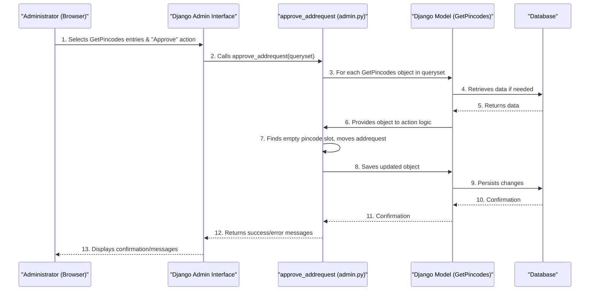

# Chapter 5: Admin Interface Management

In the [previous chapter](04_api_endpoints__views___urls__.md), we explored **API Endpoints**, which are like the special service windows that allow different computer programs (like a mobile app) to talk to our Django application. They send and receive data in structured formats like JSON.

But what if you, as the person managing the application, need to look at the data directly? What if you want to quickly see all the dealers, edit a price, check if a document was uploaded, or approve a pending request, all without writing or running any Python code?

This is where the **Admin Interface Management** comes in!

## The Problem: Managing Data Without Code

Imagine you are the administrator of our `document_dealer_details` application.
*   A dealer has requested to add a new pincode, and you need to **approve** it.
*   You want to quickly **check** if a dealer's ID document has been uploaded.
*   You need to **edit** a mistake in a price list entry.

How do you perform these tasks without having to write a new API endpoint, or using complex database commands?

This is exactly what the Django **Admin Interface** solves! It provides a built-in, ready-to-use control panel for your application.

**Our Central Use Case:** An administrator needs to easily approve a new pincode request submitted by a dealer, similar to what we discussed in [Dealer Pincode Management](02_dealer_pincode_management_.md).

## What is the Django Admin Interface? (The Control Panel Analogy)

Think of the Django **Admin Interface** as a **dedicated control panel** for your application's database.

*   It's a web-based, graphical user interface (GUI), meaning you interact with it using your mouse and keyboard in a web browser, not by typing code.
*   It lets you easily **view, add, edit, and delete** data directly from your database.
*   It's like a special backend website just for administrators to manage all the information that your application stores.

By default, Django comes with this powerful admin panel. To make our own data (like `PriceList` or `GetPincodes`) appear in this panel, we just need to "register" our data models.

## How to Manage Data in the Admin Interface

To make our data models appear in the admin panel and customize how they look and behave, we work with a special file: `dealer_details/admin.py`.

### Step 1: Making Your Data Models Visible (`admin.site.register`)

The first thing we need to do is tell Django's admin panel about our models. This is called "registering" them.

```python
# From dealer_details/admin.py
from django.contrib import admin
from dealer_details.models import PriceList, GetPincodes, add_category, documents

# Register your models here.
admin.site.register(PriceList)
admin.site.register(GetPincodes)
admin.site.register(add_category)
admin.site.register(documents)
```
After this code is in `admin.py` and your server is running, if you log into your Django admin panel (usually at `yourwebsite.com/admin/`), you will see `PriceList`, `GetPincodes`, `add_category`, and `documents` listed as clickable items. Clicking on them will show you all the entries in your database for that model!

### Step 2: Customizing How Data Is Displayed (`ModelAdmin`)

While `admin.site.register(ModelName)` makes your model visible, it might not look exactly how you want. Django allows you to create special `ModelAdmin` classes to customize the display.

Let's say we want to control what columns appear when we list `GetPincodes` entries.

```python
# From dealer_details/admin.py (continued)
# ... (imports and other code) ...

class GetPincodesAdmin(admin.ModelAdmin):
    list_display = ('id', 'dealer_id', 'addrequest', 'pincode1', 'no_of_pincodes')
    list_display_links = ('id', 'dealer_id', 'addrequest')

# Re-register with our custom Admin class
admin.site.register(GetPincodes, GetPincodesAdmin)
```
**Explanation:**
*   `class GetPincodesAdmin(admin.ModelAdmin):`: We create a new class that inherits from `admin.ModelAdmin`. This is where we'll put our customizations.
*   `list_display = (...)`: This tuple tells the admin panel exactly which fields (columns) to show when listing `GetPincodes` entries. Here, we'll see the `id`, `dealer_id`, `addrequest` (our pending request field!), `pincode1`, and the `no_of_pincodes` count.
*   `list_display_links = (...)`: These are the fields that, when clicked, will take you to the detailed editing page for that specific entry.
*   `admin.site.register(GetPincodes, GetPincodesAdmin)`: Now, instead of just registering `GetPincodes`, we tell Django to use *our* `GetPincodesAdmin` class for it.

### Step 3: Displaying Image Thumbnails

Some of our models, like `PriceList` and `documents`, have image fields. It's very helpful to see a small preview (thumbnail) of the image directly in the list view. We use a special library `admin_thumbnails` for this.

```python
# From dealer_details/admin.py (simplified)
import admin_thumbnails
from django.utils.html import format_html # To render HTML in admin

@admin_thumbnails.thumbnail('subcategory_image')
class PriceListAdmin(admin.ModelAdmin):
    def thumbnail(self, object):
        return format_html(''.format(object.subcategory_image.url))
    thumbnail.short_description = "SubImage"
    list_display= ('id', 'subcategory_name', 'thumbnail', 'price', 'unit')
    # ... other settings ...
admin.site.register(PriceList, PriceListAdmin)

@admin_thumbnails.thumbnail('Pic') # This decorator makes 'Pic' an automatic thumbnail
class documentsAdmin(admin.ModelAdmin):
    def thumbnail(self, object):
        if object.Pic and hasattr(object.Pic, 'url'):
            return format_html('', object.Pic.url)
        return "No Image"
    thumbnail.short_description = "dealer_pic"
    list_display = ('id', 'dealer_id', 'thumbnail', 'status')
    # ... other settings ...
admin.site.register(documents, documentsAdmin)
```
**Explanation:**
*   `@admin_thumbnails.thumbnail('subcategory_image')`: This is a "decorator" that automatically adds a `thumbnail` method to our class if the field `subcategory_image` exists.
*   `def thumbnail(self, object):`: We define a method called `thumbnail` that creates a small HTML `` tag.
*   `format_html(...)`: This Django function ensures that our HTML string is rendered correctly in the admin.
*   `object.subcategory_image.url`: This gets the web address (URL) of the image file.
*   We then add `'thumbnail'` to `list_display` to show this custom image column.

Now, when you view the list of Price Lists or Documents in the admin, you'll see small image previews directly in the table!

### Step 4: Adding Custom Actions (Solving Our Use Case: Approving Pincodes)

This is the most powerful part for our use case. We want to be able to select one or more `GetPincodes` entries and click a button to approve their `addrequest`. Django admin allows us to define "actions" that appear in a dropdown menu.

```python
# From dealer_details/admin.py (simplified, focuses on the action)
from django.contrib import messages # To show success/error messages
from django.contrib import admin
from dealer_details.models import GetPincodes

@admin.action(description='Approve Addrequest and Add Pincode(s)')
def approve_addrequest(modeladmin, request, queryset):
    for obj in queryset: # Loop through selected GetPincodes entries
        if obj.addrequest: # Is there a pending request?
            # Find the next available pincode slot (pincode1 to pincode11)
            pincode_fields = ['pincode1', 'pincode2', 'pincode3', 'pincode4', 'pincode5', 
                              'pincode6', 'pincode7', 'pincode8', 'pincode9', 'pincode10', 'pincode11']
            
            filled_slot = False
            for field_name in pincode_fields:
                if getattr(obj, field_name) in [None, '']: # Is this slot empty?
                    setattr(obj, field_name, obj.addrequest) # Move pending request to this slot
                    filled_slot = True
                    break # Found an empty slot, stop searching
            
            if filled_slot:
                obj.addrequest = None # Clear the pending request
                # Recalculate the count of active pincodes
                obj.no_of_pincodes = sum(1 for field in pincode_fields if getattr(obj, field))
                obj.save() # Save changes to database
                messages.success(request, f"{obj.dealer_id}: Pincode(s) added successfully.")
            else:
                messages.error(request, f"{obj.dealer_id}: No empty pincode slots available.")
        else:
            messages.warning(request, f"{obj.dealer_id}: No addrequest to process.")

class GetPincodesAdmin(admin.ModelAdmin):
    list_display = ('id', 'dealer_id', 'addrequest', 'pincode1', 'no_of_pincodes')
    actions = [approve_addrequest] # Make our custom action available here

admin.site.register(GetPincodes, GetPincodesAdmin)
```
**Explanation:**
*   `@admin.action(...)`: This decorator transforms our regular Python function `approve_addrequest` into an admin action that will appear in the "Actions" dropdown menu.
*   `modeladmin, request, queryset`: These are standard inputs for an admin action function. `queryset` is the most important; it contains all the `GetPincodes` objects the administrator has *selected* in the list.
*   `for obj in queryset:`: We loop through each selected `GetPincodes` object.
*   `if obj.addrequest:`: We check if this specific `GetPincodes` entry has a value in its `addrequest` field (meaning a pincode is pending approval).
*   `getattr(obj, field_name)` and `setattr(obj, field_name, value)`: These are Python functions that allow us to get (`getattr`) or set (`setattr`) the value of a field on an object using its name as a string (e.g., `'pincode1'`). This lets us loop through our `pincode1` to `pincode11` fields dynamically.
*   The loop finds the *first empty* `pincodeX` slot, moves the `addrequest` value into it, clears `addrequest`, updates `no_of_pincodes`, and saves the object.
*   `messages.success/error/warning`: These functions display feedback messages to the administrator right in the admin panel.
*   `actions = [approve_addrequest]`: In our `GetPincodesAdmin` class, we add our `approve_addrequest` function to the `actions` list. This makes it appear in the dropdown menu.

Now, an administrator can go to the `GetPincodes` list, tick the checkbox next to entries that have `addrequest` values, select "Approve Addrequest and Add Pincode(s)" from the dropdown, and click "Go." The system will automatically process the requests!

## Under the Hood: Admin Action Flow

Let's visualize how an admin action like approving pincodes works:



1.  **Administrator Interacts**: The admin user logs into the Django Admin interface in their web browser. They navigate to the `GetPincodes` section. They see a list of pincode entries and notice some have values in the `addrequest` field. They select one or more of these entries using checkboxes.
2.  **Triggers Action**: The admin selects "Approve Addrequest and Add Pincode(s)" from the "Actions" dropdown menu and clicks the "Go" button.
3.  **Admin Action Code Runs**: The Django Admin system receives this request and calls our `approve_addrequest` function, passing it the `queryset` (a collection of the selected `GetPincodes` objects).
4.  **Process Each Object**: The `approve_addrequest` function then loops through each `GetPincodes` object in the `queryset`.
5.  **Update Logic**: For each object, it checks if `addrequest` has a value. If so, it finds the first available `pincodeX` slot (from `pincode1` to `pincode11`), moves the `addrequest` value into that slot, clears the `addrequest` field, and recalculates the `no_of_pincodes` count.
6.  **Save to Database**: After making these changes to the `GetPincodes` object in memory, `obj.save()` is called. This tells the [Django Model](01_data_models_.md) to save the updated information back to the [Database](01_data_models_.md).
7.  **Feedback**: Finally, `messages.success()` or `messages.error()` are used to display clear feedback to the administrator right in the admin panel, confirming whether the action was successful or if there were any issues.

This entire process provides a powerful, user-friendly way for administrators to manage critical data within the application without needing to write or execute complex code.

## Conclusion

In this chapter, we discovered the power of Django's built-in **Admin Interface**. We learned how to register our [Data Models](01_data_models_.md) to make them visible in this control panel. We also explored how to customize their display using `ModelAdmin`, show image thumbnails, and most importantly, how to create custom "actions" (like `approve_addrequest`) that allow administrators to perform complex operations directly from the web interface. This makes managing our application's data much easier and more intuitive for non-developers.

We've now covered all the core components of the `document_dealer_details` project, from how data is structured to how it's managed via APIs and the admin interface.

---

<sub><sup>Generated by [AI Codebase Knowledge Builder](https://github.com/The-Pocket/Tutorial-Codebase-Knowledge).</sup></sub> <sub><sup>**References**: [[1]](https://github.com/snehabansal483/document_dealer_details/blob/3a6a056be89f90b25576832be3c4f2c44f3ea086/dealer_details/admin.py)</sup></sub>